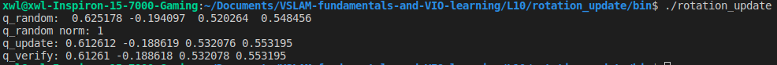

## 1.VIO文献阅读
**1.1 视觉与IMU进行融合之后有何优势？**
**视觉**优势在于其不产生漂移，并可以直接测量旋转与平移；但是易受外界环境如光照、遮挡、动态物体等影响，并且单目视觉无法测量尺度，对纯旋转运动也无法进行估计，同时快速运动时图像匹配不上易跟丢
**IMU**优势在于响应快，不太受外界环境影响，角速度测量比较准，并可以估计绝对尺度；但是其存在零漂，直接对数据积分位姿也容易发散
视觉和IMU的特点几乎是互补的，用来融合构建里程计非常make sense

**1.2 哪些常见的视觉+IMU融合方案？工业界应用的例子？**
常见方案：大体上可以分为基于滤波和基于优化的两类融合方案，基于滤波的有MSCKF，ROVIO，R-VIO, OpenVINS，基于优化的有VINS, OKVIS, VIORB等
工业界的应用：Google的Project Tango, 用到了MSCKF; 一些无人机、AR\VR中的定位方案也是用的VIO算法

**1.3 学术界中，VIO研究有哪些新进展？学习方法用到VIO中的例子？**
学术界中VIO提高的方向包括精度、鲁棒性和效率三部分
在VIO中，可以用深度学习网络来预测相机的位姿状态、场景深度。还可以用网络剔除动态物体等来提高VIO系统的鲁棒性
利用了深度学习的例子包括D3VO(使用深度学习来预测场景深度、光度、姿态等)，VINet(使用深度学习来预测相机位姿)，DeepVO(使用网络来预测位姿)等

## 2.四元数和李代数更新
**验证两种更新方式一致，所编写的代码主要分为以下4个步骤**
*1.生成随机四元数*

    Eigen::Vector4d q_random = Eigen::Vector4d::Random();
    q_random.normalize();
    Eigen::Quaterniond q_init(q_random[0], q_random[1], q_random[2], q_random[3]);

*2.四元数转旋转矩阵*

    Eigen::Matrix3d R_init = q_init.toRotationMatrix();

*3.四元数和旋转矩阵分别进行更新*

    Eigen::Vector3d w(0.01, 0.02, 0.03);
    Eigen::Quaterniond delta_q(1, 0.5 * w.x(), 0.5 * w.y(), 0.5 * w.z());
    Eigen::Quaterniond q_update = q_init * delta_q;
    q_update.normalize();
    Eigen::Matrix3d R_update = R_init * skew_symmetric(w).exp();

    // 其中，skew_symmetric函数将三维向量转化为反对称矩阵
    // Eigen::Matrix3d skew_symmetric(const Eigen::Vector3d &w)
    // {
        // Eigen::Matrix3d mat;
        // mat << 0, -w.z(), w.y(), w.z(), 0, -w.x(), -w.y(), w.x(), 0;
        // return mat;
    // }

*4.比较更新后的两个四元数*

    Eigen::Quaterniond q_verify(R_update);
    std::cout << "q_update: " << q_update.w() << " " << q_update.x() << " " 
        << q_update.y() << " " << q_update.z() << std::endl;
    std::cout << "q_verify: " << q_verify.w() << " " << q_verify.x() << " "
        << q_verify.y() << " " << q_verify.z() << std::endl;
              

## 3.其他导数
**使用右乘$\mathfrak{so}(3)$，推导以下导数**
* $$\frac{d \boldsymbol{(R^{-1}p)} }{d \boldsymbol{R} }$$
**这个题目本身不难，但需要我们注意并回忆起以下几点内容：**
*1. 对哪个变量求导，扰动就要作用到该变量上，例如我们现在分母是$dR$那就是对$R$求导，分子的扰动就得作用到$R$上面*
*2. $R、exp(\phi^\wedge)、Rexp(\phi^\wedge)$都是旋转矩阵，对于旋转矩阵来说，$R^{-1} = R^T$*
*3. 反对称矩阵的性质：$(\phi^\wedge)^T = -(\phi^\wedge)$*
*4. $\lim\limits_{\phi \to 0} exp(\phi^\wedge) = I+\phi^\wedge$*
*5. $a^\wedge b = -b^\wedge a$*

**综合上面几点，不难得出下面推导结果：**
$
\frac{d(R^{-1}p)}{dR} 
= \lim\limits_{\phi \to 0} \frac{(Rexp(\phi^\wedge))^{-1}p - R^{-1}p}{\phi} 
= \lim\limits_{\phi \to 0} \frac{exp(\phi^\wedge)^{-1}R^{-1}p - R^{-1}p}{\phi} 
= \lim\limits_{\phi \to 0} \frac{(I+\phi^\wedge)^{-1}R^{-1}p - R^{-1}p}{\phi}
= \lim\limits_{\phi \to 0} \frac{-\phi^\wedge R^{-1} p}{\phi}
= \lim\limits_{\phi \to 0} \frac{(R^{-1}p)^\wedge\phi}{\phi}
= (R^{-1}p)^\wedge
$

* $$\frac{dln \boldsymbol{(R_1R_2^{-1})}^\vee }{d \boldsymbol{R_2} }$$
**跟上面那个题目类似，也是需要我们注意并回忆起以下几点内容：**
*1. BCH近似：$\lim\limits_{\phi \to 0}ln(Rexp(\phi^\wedge))^\vee = ln(R)^\vee + J_{r}^{-1}(R)\phi, J_{r}^{-1}(R)$为$SO(3)$上的右雅可比*
*2. $SO(3)$的伴随性质：$R^Texp(\phi^\wedge)R = exp((R^T\phi)^\wedge)$*
*3. 对哪个变量求导，扰动就要作用到该变量上，例如我们现在分母是$dR_2$那就是对$R_2$求导，分子的扰动就得作用到$R_2$上面*
*4. 同时需要注意的是，求导之后结果是要给状态更新用的，左乘或右乘求出导数不同，更新时必须保持对应左右乘*

**综合上面几点，不难得出下面推导结果：**
$
\frac{dln(R_1R_2^{-1})^\vee }{dR_2}
= \lim\limits_{\phi \to 0} \frac{ln(R_1(R_2exp(\phi^\wedge))^{-1})^\vee - ln(R_1R_2^{-1})^\vee}{\phi}
= \lim\limits_{\phi \to 0} \frac{ln(R_1exp(\phi^\wedge)^{-1}R_2^{-1})^\vee - ln(R_1R_2^{-1})^\vee}{\phi}
= \lim\limits_{\phi \to 0} \frac{ln(R_1R_2^{-1}exp((R_2(-\phi))^\wedge))^\vee - ln(R_1R_2^{-1})^\vee}{\phi}
= \lim\limits_{\phi \to 0} \frac{J_r^{-1}(ln(R_1R_2^{-1})^\vee)R_2(-\phi)}{\phi}
= -J_r^{-1}(ln(R_1R_2^{-1})^\vee)R_2
$

## Appendix
// 第2题参考代码如下：

    #include <iostream>

    #include <Eigen/Eigen>
    #include <Eigen/Geometry>
    #include <unsupported/Eigen/MatrixFunctions>

    Eigen::Matrix3d skew_symmetric(const Eigen::Vector3d &w)
    {
        Eigen::Matrix3d mat;
        mat << 0, -w.z(), w.y(), w.z(), 0, -w.x(), -w.y(), w.x(), 0;
        return mat;
    }

    int main()
    {
        Eigen::Vector4d q_random = Eigen::Vector4d::Random();
        q_random.normalize();
        Eigen::Quaterniond q_init(q_random[0], q_random[1], q_random[2], q_random[3]);

        Eigen::Matrix3d R_init = q_init.toRotationMatrix();

        Eigen::Vector3d w(0.01, 0.02, 0.03);
        Eigen::Quaterniond delta_q(1, 0.5 * w.x(), 0.5 * w.y(), 0.5 * w.z());
        Eigen::Quaterniond q_update = q_init * delta_q;
        q_update.normalize();
        Eigen::Matrix3d R_update = R_init * skew_symmetric(w).exp();

        Eigen::Quaterniond q_verify(R_update);
        std::cout << "q_update: " << q_update.w() << " " << q_update.x() << " "
                << q_update.y() << " " << q_update.z() << std::endl;
        std::cout << "q_verify: " << q_verify.w() << " " << q_verify.x() << " "
                << q_verify.y() << " " << q_verify.z() << std::endl;

        return 0;
    }