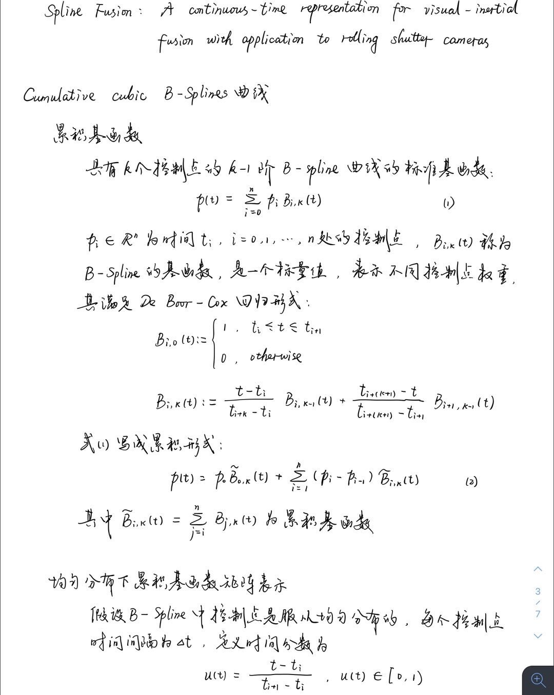
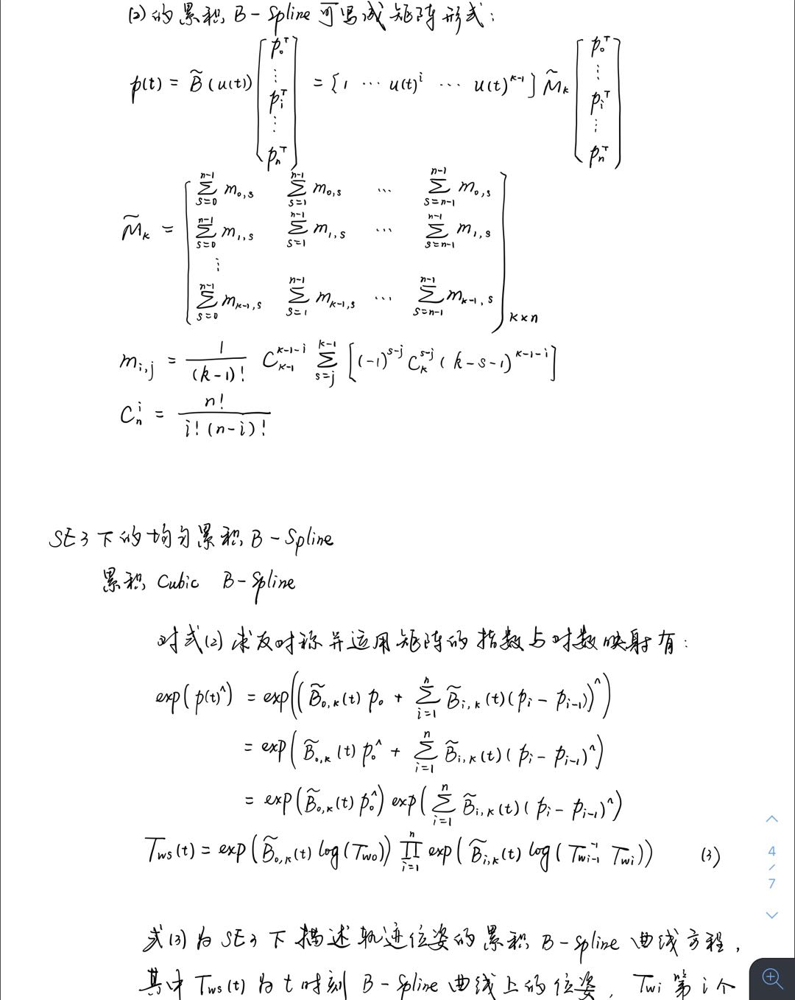
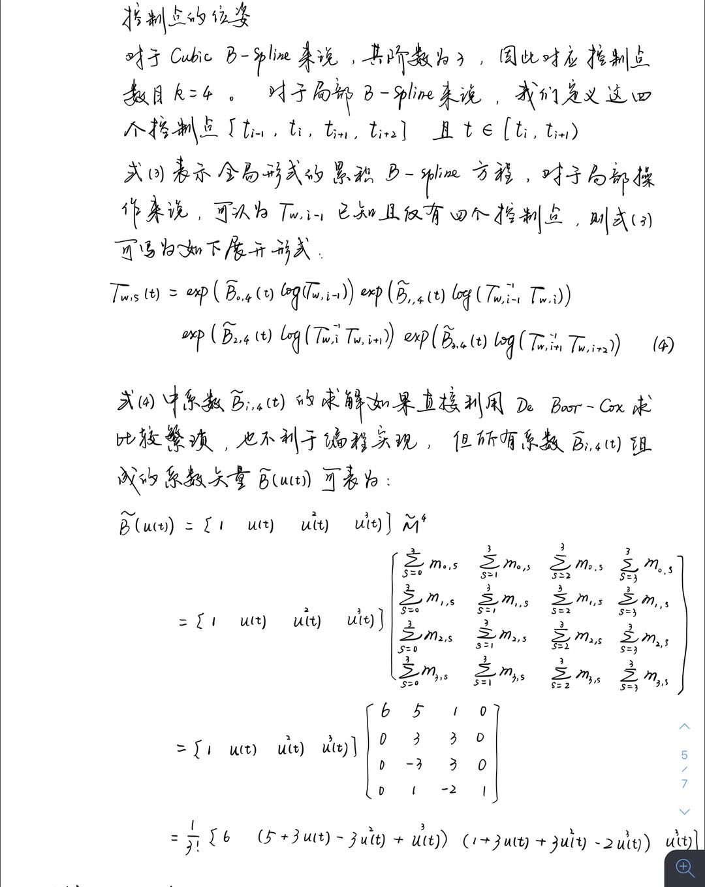
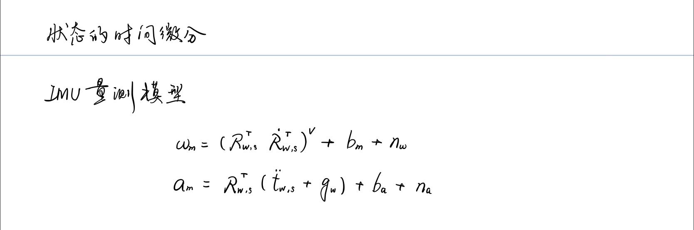

## 1.设置参数，生成Allan方差标定曲线

imu_utils是港科沈老师组标定IMU的工具，代码编译运行更加方便。而kalibr_allan是rpng黄国权老师组用来标定IMU的工具，需要在ubuntu中安装matlab，操作更为繁琐。在这里，以imu_utils标定imu内参给大家举例。

首先，我们需要在电脑上安装ROS，然后创建一个工作空间catkin_ws，在catkin_ws目录下创建src目录，即

    mkdir catkin_ws
    cd catkin_ws && mkdir src && cd src

然后我们将code_utils功能包和imu_utils功能包拷贝到src目录下：

    git clone https://github.com/gaowenliang/code_utils.git
    git clone https://github.com/gaowenliang/imu_utils.git

首先编译code_utils功能包，在catkin_ws目录下进行编译：

    cd .. && catkin_make -DCATKIN_WHITELIST_PACKAGES="code_utils"

在编译code_utils时可能会碰到找不到backward.hpp这个头文件的报错，解决方案有以下几种：

    方案一：
    src/code_utils/CMakeLists.txt中，添加路径：include_directories("include/code_utils")
    方案二：
    src/code_utils/src/sumpixel_test.cpp中的#include "backward.hpp"改为
        #include "code_utils/backward.hpp"
    方案三：（不推荐）
    src/code_utils/include/backward.hpp文件扔到src/code_utils/src中

然后再编译imu_utils功能包:

    catkin_make -DCATKIN_WHITELIST_PACKAGES="imu_utils"

至此，imu_utils编译完成，可以利用课程提供的ROS功能包生成特定的imu数据集（rosbag），然后启动imu_utils工具，播放rosbag，标定imu内参

使用imu_utils标定，分别设置3组imu参数：
第一组：

    设定值为---
    g_w: 5.0e-5
    a_w: 5.0e-4
    g_n: 0.015
    a_n: 0.019
    标定值为---
    g_n: 2.1399140014220999e-01/sqrt(200) = 0.01513147701
    a_n: 2.6874358954838429e-01/sqrt(200) = 0.01900304145

第二组：

    设定值为---
    g_w: 3.0e-4
    a_w: 2.0e-3
    g_n: 0.056
    a_n: 0.078
    标定值为---
    g_n: 7.9063566508284433e-01/sqrt(200) = 0.05590638402
    a_n: 1.1078258512014039e+00/sqrt(200) = 0.07833511717

第三组：

    设定值为---
    g_w: 1.0e-3
    a_w: 1.0e-2
    g_n: 1.0e-2
    a_n: 1.0e-1
    标定值为---
    g_n: 1.4110400375839960e-01/sqrt(200) = 0.00997755979
    a_n: 1.4026838880597403e+00/sqrt(200) = 0.09918472891

绘制第三组数据的Allan方差曲线为：
gyroscope:

accelerometer:

## 2.IMU仿真代码中欧拉积分替换成中值积分
欧拉积分的代码片段为：

    // 欧拉积分
    MotionData imu_data1 = imudata[i];

    // delta_q = [1 , 1/2 * thetax , 1/2 * theta_y, 1/2 * theta_z]
    Eigen::Quaterniond dq;
    Eigen::Vector3d dtheta_half = imu_data1.imu_gyro * dt / 2.0;
    dq.w() = 1;
    dq.x() = dtheta_half.x();
    dq.y() = dtheta_half.y();
    dq.z() = dtheta_half.z();
    dq.normalize();

    // aw = Rwb * ( acc_body - acc_bias ) + gw
    Eigen::Vector3d acc_w = Qwb * (imu_data1.imu_acc) + gw; 
    Qwb = Qwb * dq;
    Pwb = Pwb + Vw * dt + 0.5 * dt * dt * acc_w;
    Vw = Vw + acc_w * dt;

数据仿真效果为：

改为中值积分：

    // 中值积分 
    MotionData imu_data0 = imudata[i - 1]; // 上一时刻的imu数据
    MotionData imu_data1 = imudata[i];     // 当前时刻的imu数据

    Eigen::Quaterniond dq;
    Eigen::Vector3d dtheta_half = (imu_data0.imu_gyro + imu_data0.imu_gyro)*dt/4.0;
    dq.w() = 1;
    dq.x() = dtheta_half.x();
    dq.y() = dtheta_half.y();
    dq.z() = dtheta_half.z();
    dq.normalize();

    Eigen::Vector3d acc_w = (Qwb * dq * (imu_data1.imu_acc) + gw + 
        Qwb * (imu_data0.imu_acc) + gw) / 2;
    Qwb = Qwb * dq;
    Pwb = Pwb + Vw * dt + 0.5 * dt * dt * acc_w;
    Vw = Vw + dt * acc_w;

数据仿真效果为：

可以明显看到，中值积分精度更高，数据仿真效果更好。

## 提升作业

