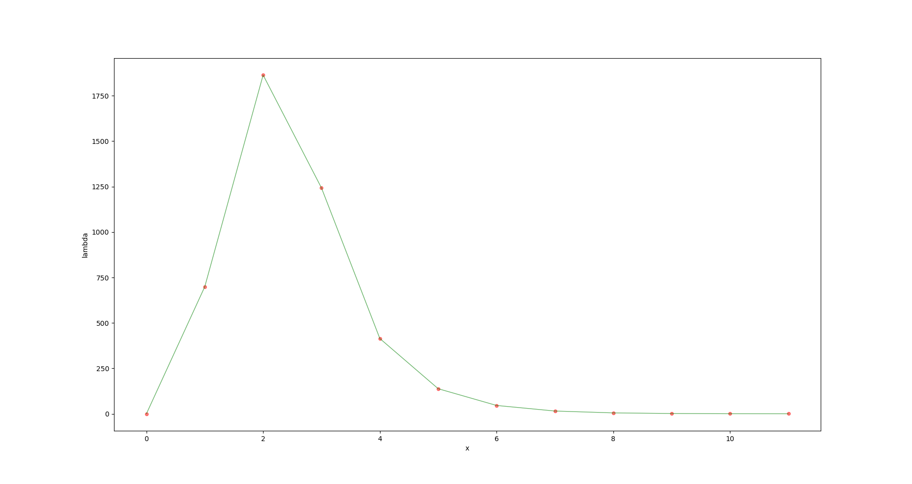
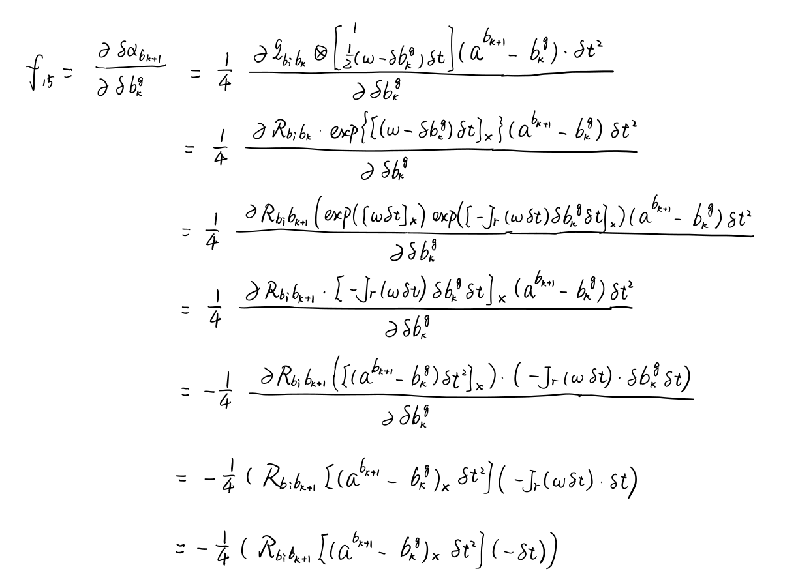

## 1.LM算法相关
*1.1 绘制阻尼因子$\mu$随迭代变化曲线图*

*1.2 改曲线函数，修改代码中残差计算，实现曲线参数估计*
修改CurveFitting.cpp代码中部分如下：

    main函数部分：
    double x = i / 100.;
    double n = noise(generator);
    // 观测 y
    // double y = std::exp( a*x*x + b*x + c ) + n;
    double y = a * x * x + b * x + c + n;

    ComputeResidual函数部分：
    Vec3 abc = verticies_[0]->Parameters();                      // 估计的参数
    residual_(0) = abc(0) * x_ * x_ + abc(1) * x_ + abc(2) - y_; // 构建残差

    ComputeJacobians函数部分：
    Eigen::Matrix<double, 1, 3> jaco_abc; // 误差为1维，状态量 3 个，所以是 1x3 的雅克比矩阵
    jaco_abc << x_ * x_, x_, 1;
    jacobians_[0] = jaco_abc;

并且将采样数据点N增大为1000，得到结果如下：

*1.3 实现更优秀的阻尼因子策略，给出实验对比*
论文《The Levenberg-Marquardt method for nonlinear least squares curve-fitting problems》中有三种阻尼因子策略，如下图所示：

原代码中采用的是第3种策略，即Nielsen策略。下面在原代码problem.cc基础上实现论文中第1种阻尼因子更新策略，修改代码为：

    void Problem::ComputeLambdaInitLM()
    {
        currentChi_ = 0.0;
        // TODO:: robust cost chi2
        for (auto edge : edges_)
        {
            currentChi_ += edge.second->Chi2();
        }
        if (err_prior_.rows() > 0)
            currentChi_ += err_prior_.norm();

        stopThresholdLM_ = 1e-6 * currentChi_; // 迭代条件为 误差下降 1e-6 倍
        currentLambda_ = 1e-3;
    }

    void Problem::AddLambdatoHessianLM()
    {
        ulong size = Hessian_.cols();
        assert(Hessian_.rows() == Hessian_.cols() && "Hessian is not square");
        for (ulong i = 0; i < size; ++i)
        {
            Hessian_(i, i) += currentLambda_ * Hessian_(i, i);
        }
    }

    void Problem::RemoveLambdaHessianLM()
    {
        ulong size = Hessian_.cols();
        assert(Hessian_.rows() == Hessian_.cols() && "Hessian is not square");
        for (ulong i = 0; i < size; ++i)
        {
            Hessian_(i, i) /= 1.0 + currentLambda_;
        }
    }

    bool Problem::IsGoodStepInLM()
    {
        // 统计所有的残差
        double tempChi = 0.0;
        for (auto edge : edges_)
        {
            edge.second->ComputeResidual();
            tempChi += edge.second->Chi2();
        }
        // compute rho
        assert(Hessian_.rows() == Hessian_.cols() && "Hessian is not square");
        ulong size = Hessian_.cols();
        MatXX diag_hessian(MatXX::Zero(size, size));
        for (ulong i = 0; i < size; ++i)
        {
            diag_hessian(i, i) = Hessian_(i, i);
        }
        double scale = delta_x_.transpose() * 
            (currentLambda_ * diag_hessian * delta_x_ + b_);
        double rho = (currentChi_ - tempChi) / scale;
        // update currentLambda_
        double epsilon = 0.0;
        double L_down = 9.0;
        double L_up = 11.0;
        if (rho > epsilon && isfinite(tempChi))
        {
            currentLambda_ = std::max(currentLambda_ / L_down, 1e-7);
            currentChi_ = tempChi;
            return true;
        }
        else
        {
            currentLambda_ = std::min(currentLambda_ * L_up, 1e7);
            return false;
        }
    }

代码运行结果为：

## 2.公式推导

## 3.证明式(9)

