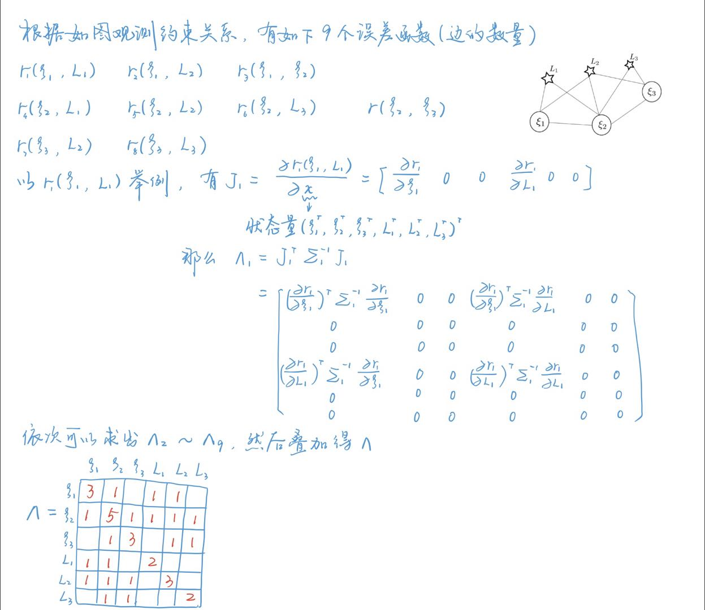
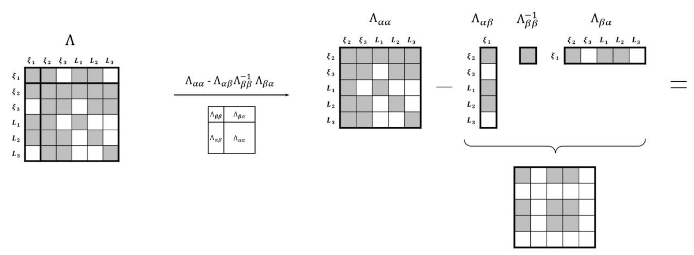
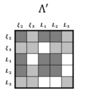
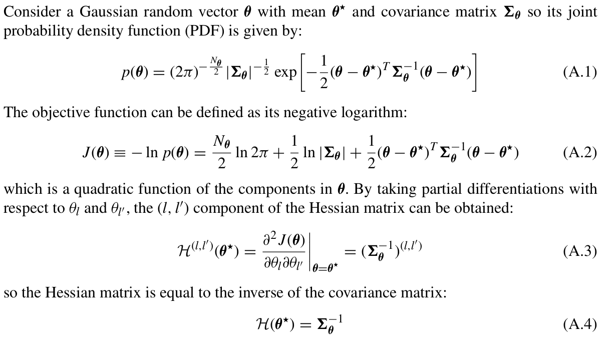
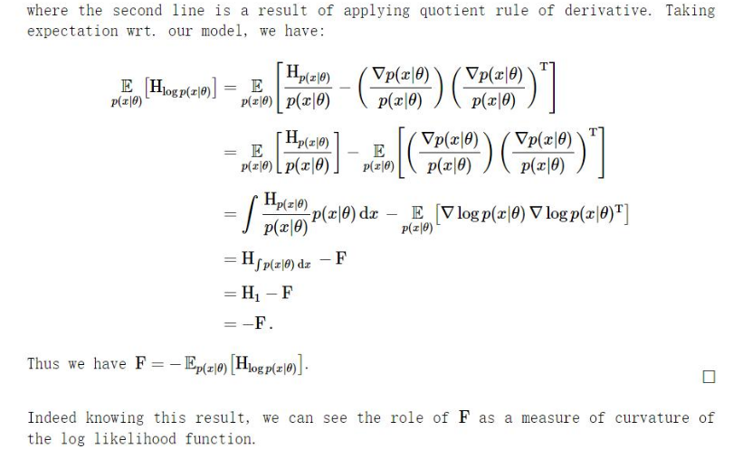
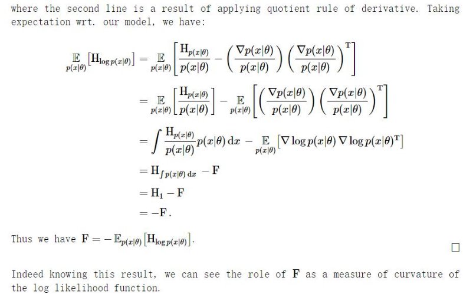
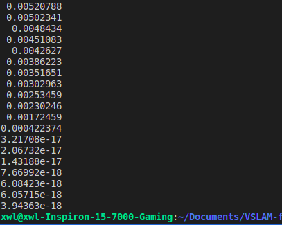

## 1.信息矩阵相关
*1.1 绘制上述系统的信息矩阵$\Lambda$*
我们可以先将系统所有约束对应的小信息矩阵求出，然后进行累加。
在求小信息矩阵时，只有与约束（即图中的边）相连接的变量（即图中的节点）所对应位置才有值，其余为0。

总结一下也不难发现，非对角线上如果顶点之间存在一条边，该处对应累加元素个数为1，对角线上累加元素个数为与该顶点相连的边的个数。

*1.2 绘制相机$\xi_1$被marg后的信息矩阵$\Lambda^{'}$*
将$\xi_1$进行边缘化，根据原来的系统，与$\xi_1$相连的有$\xi_2，L_1，L_2$，边缘化操作后，这三者之间便会两两相连。

观察可见，和$\Lambda_{aa}$相比，由于增加了$\xi_2，L_1，L_2$之间的关联，信息矩阵变得更加稠密了。

## 2.证明信息矩阵与协方差的逆之间的关系
*1.Hessian矩阵和协方差逆的关系*
一个多元高斯随机变量的概率密度函数的负对数函数的Hessian矩阵，和其协方差矩阵的逆是相等的。

*2.Hessian矩阵和信息矩阵的关系*
似然分布的概率密度函数的负对数函数的Hessian矩阵的期望等于信息矩阵。

综上所述，负对数最大似然估计的Hessian矩阵就是信息矩阵，同时也等于协方差矩阵的逆。所以平时往往就直接将协方差矩阵的逆当作信息矩阵。

## 3.零空间
补充代码部分需要我们回忆起重投影误差关于特征点坐标和相机位姿的雅可比如何写，并将其填入对应的位置即可。
源代码中的jacobian_Pj表示重投影误差对特征点的雅可比，计算其的理论依据参见《SLAM十四讲》P.187的公式（7.48）；jacobian_Ti表示重投影误差对相机位姿的雅可比，可以参见《SLAM十四讲》P.187的公式（7.46）。
以下给出相关代码实现：

    H.block(i * 6, i * 6, 6, 6) += jacobian_Ti.transpose() * jacobian_Ti;
    /// 请补充完整作业信息矩阵块的计算
    H.block(i * 6, poseNums * 6 + j * 3, 6, 3) += jacobian_Ti.transpose() * jacobian_Pj;
    H.block(poseNums * 6 + j * 3, i * 6, 3, 6) += jacobian_Pj.transpose() * jacobian_Ti;
    H.block(poseNums * 6 + j * 3, poseNums * 6 + j * 3, 3, 3) += 
        jacobian_Pj.transpose() * jacobian_Pj;

奇异值最后7维接近0，即零空间维度为7。在单目视觉SLAM中，信息矩阵存在一个7维零空间，对应7自由度的不可观量。