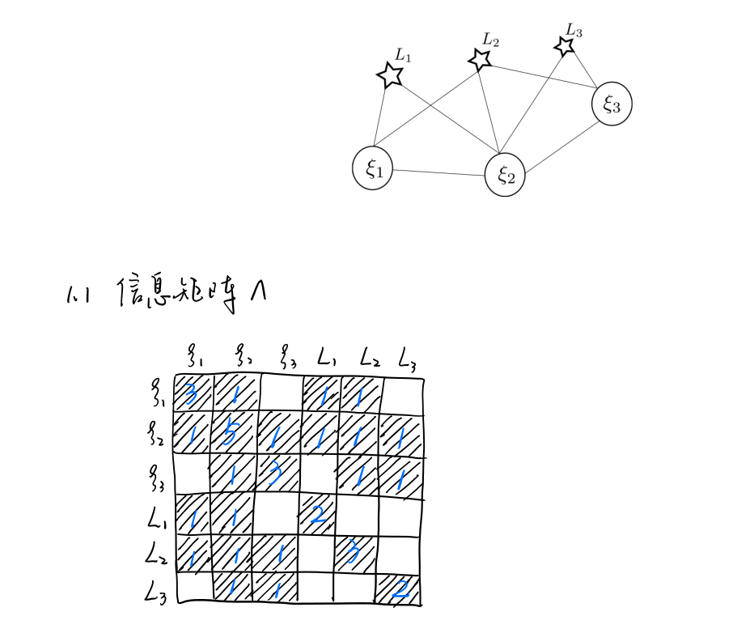
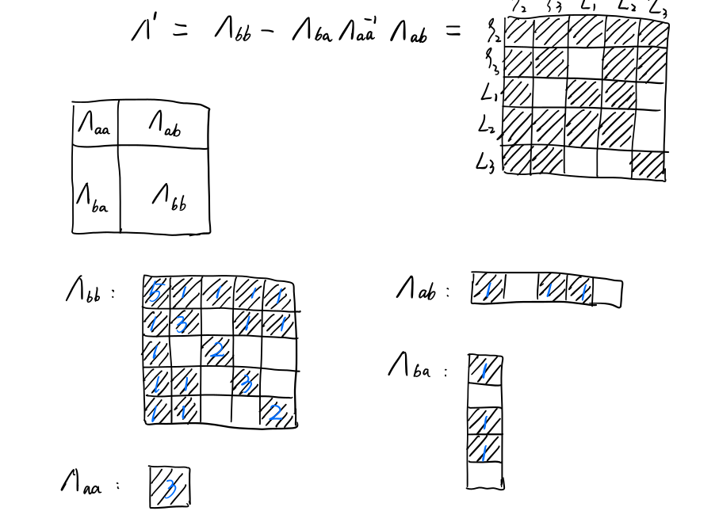
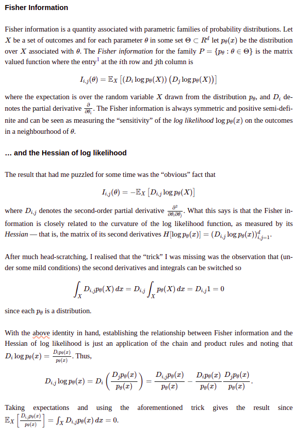

## 1.信息矩阵相关

*1.1 绘制上述系统的信息矩阵$\Lambda$*

*1.2 绘制相机$\xi_1$被marg后的信息矩阵$\Lambda^{'}$*

## 2.证明信息矩阵与协方差的逆之间的关系

信息矩阵与对数似然函数的负的Hessian矩阵相等，并且在高斯分布的假设下，Hessian of Negative Log Likelihood即Inverse of Covariance Matrix

## 3.零空间
    H.block(i * 6, i * 6, 6, 6) += jacobian_Ti.transpose() * jacobian_Ti;
    /// 请补充完整作业信息矩阵块的计算
    H.block(i * 6, poseNums * 6 + j * 3, 6, 3) += jacobian_Ti.transpose() * jacobian_Pj;
    H.block(poseNums * 6 + j * 3, i * 6, 3, 6) += jacobian_Pj.transpose() * jacobian_Ti;
    H.block(poseNums * 6 + j * 3, poseNums * 6 + j * 3, 3, 3) += 
        jacobian_Pj.transpose() * jacobian_Pj;

奇异值最后7维接近0，即零空间维度为7