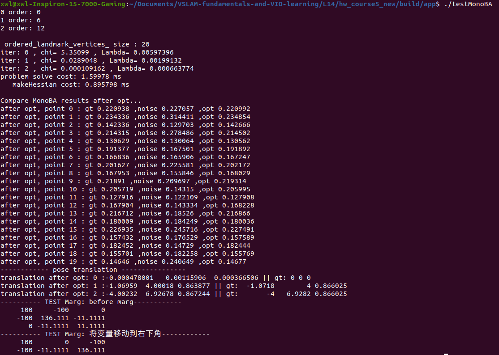
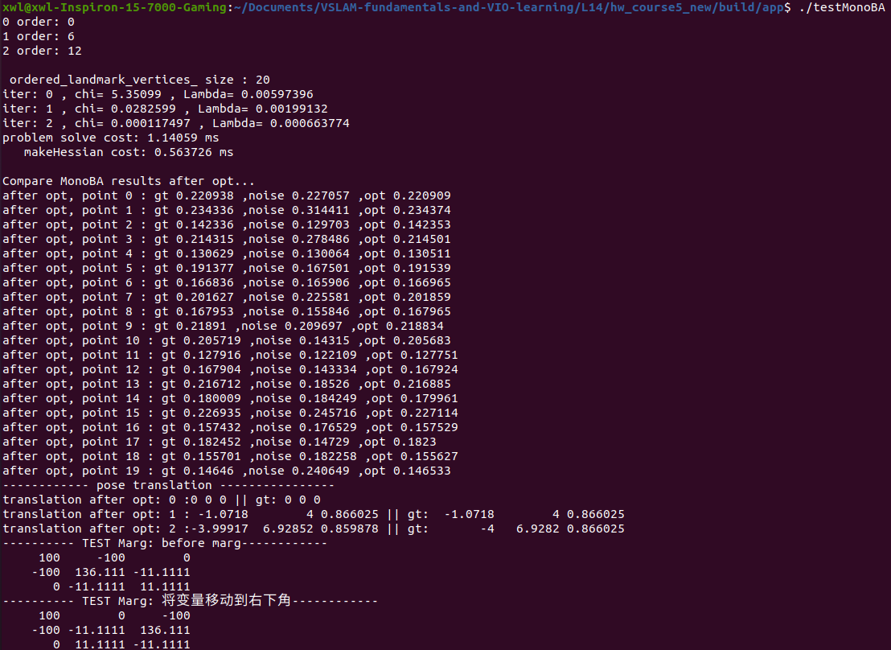
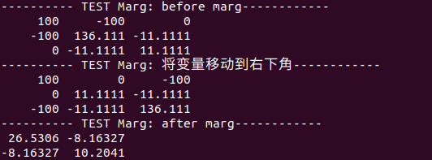
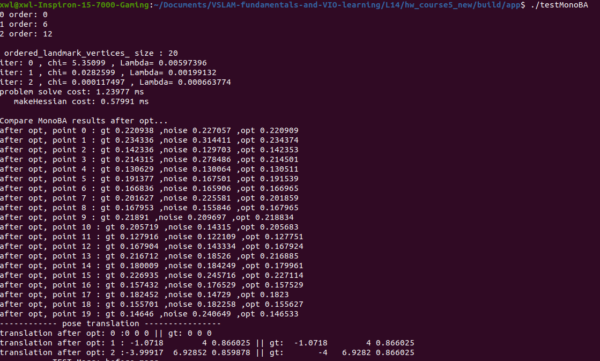
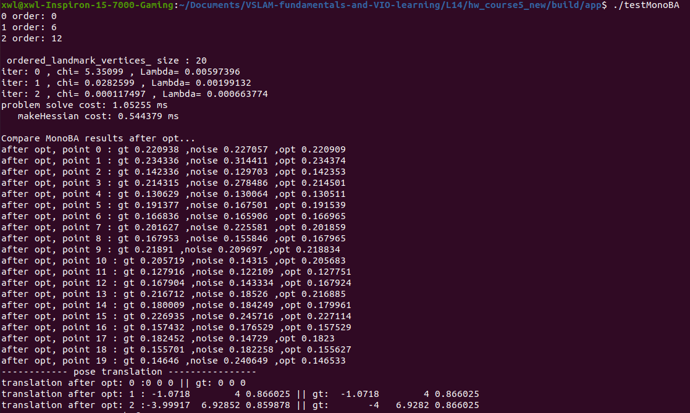

## 1.完成单目BA求解器problem.cc中的部分代码
*完成Problem::MakeHessian()中信息矩阵H的计算*

    // 所有的信息矩阵叠加起来
    // TODO:: home work. 完成 H index 的填写.
    H.block(index_i, index_j, dim_i, dim_j).noalias() += hessian;
    if (j != i)
    {
        // 对称的下三角
        // TODO:: home work. 完成 H index 的填写.
        H.block(index_j, index_i, dim_j, dim_i).noalias() += hessian.transpose();
    }

*完成Problem::SolveLinearSystem()中SLAM问题的求解*

    // TODO:: home work. 完成矩阵块取值，Hmm，Hpm，Hmp，bpp，bmm
    MatXX Hmm = Hessian_.block(ordering_poses_, ordering_poses_, ordering_landmarks_, 
        ordering_landmarks_);
    MatXX Hpm = Hessian_.block(0, ordering_poses_, ordering_poses_, ordering_landmarks_);
    MatXX Hmp = Hessian_.block(ordering_poses_, 0, ordering_landmarks_, ordering_poses_);
    VecX bpp = b_.segment(0, ordering_poses_);
    VecX bmm = b_.segment(ordering_poses_, ordering_landmarks_);

    // TODO:: home work. 完成舒尔补 Hpp, bpp 代码
    MatXX tempH = Hpm * Hmm_inv;
    H_pp_schur_ = Hessian_.block(0, 0, ordering_poses_, ordering_poses_) - tempH * Hmp;
    b_pp_schur_ = bpp - tempH * bmm;

    // TODO:: home work. step3: solve landmark
    VecX delta_x_ll(marg_size);
    delta_x_ll = Hmm_inv * (bmm - Hmp * delta_x_pp);
    delta_x_.tail(marg_size) = delta_x_ll;

未fix前两帧位姿：

fix前两帧位姿：

可以看到，fix前两帧位姿后，第一帧相机的位置变为了(0, 0, 0)

## 2.完成滑动窗口算法测试函数
*完成Problem::TestMarginalize()中代码，并通过测试*

    // TODO:: home work. 将变量移动到右下角
    /// 准备工作： move the marg pose to the Hmm bottown right
    // 将 row i 移动矩阵最下面
    Eigen::MatrixXd temp_rows = H_marg.block(idx, 0, dim, reserve_size);
    Eigen::MatrixXd temp_botRows = H_marg.block(idx + dim, 0, reserve_size - idx - dim, reserve_size);
    H_marg.block(idx, 0, reserve_size - idx - dim, reserve_size) = temp_botRows;
    H_marg.block(reserve_size - dim, 0, dim, reserve_size) = temp_rows

    // TODO:: home work. 完成舒尔补操作
    Eigen::MatrixXd Arm = H_marg.block(0, n2, n2, m2);
    Eigen::MatrixXd Amr = H_marg.block(n2, 0, m2, n2);
    Eigen::MatrixXd Arr = H_marg.block(0, 0, n2, n2);

## 3.总结论文：优化过程中处理H自由度的不同操作方式
论文中总结了三种处理H自由度的方式，分别为：
* gauge fixation approach: 在一个较小的参数空间中进行优化，在这个空间中不存在不可观测的状态，因此Hessian是可逆的。这本质上强制了解决方案的硬约束
* gauge prior approach: 用附加惩罚(产生一个可逆的Hessian)来扩充目标函数，以使解决方案以一种度量先验方法满足某些约束
* free gauge approach: 可以使用奇异Hessian的伪逆来隐式地为唯一解(free gauge approach)提供额外的约束(最小范数的参数更新)

## 4.在代码中为第一、二帧添加prior约束，并比较为prior设定不同权重时，BA求解收敛精度和速度

    // 添加先验约束，更改prior的权重Wp
    double Wp = 0;
    for (size_t k = 0; k < 2; ++k)
    {
        shared_ptr<EdgeSE3Prior> edge_prior(new EdgeSE3Prior(cameras[k].twc, cameras[k].qwc));
        std::vector<std::shared_ptr<Vertex>> edge_prior_vertex;
        edge_prior_vertex.push_back(vertexCams_vec[k]);
        edge_prior->SetVertex(edge_prior_vertex);
        edge_prior->SetInformation(edge_prior->Information() * Wp);
        problem.AddEdge(edge_prior);
    }

当Wp = 0时：

当Wp = 1e5时：

当先验约束权重大于一定值时，迭代次数和收敛时间趋向于稳定，当先前的权重从0增加到稳定的阈值时，在计算时间上会有一个峰值