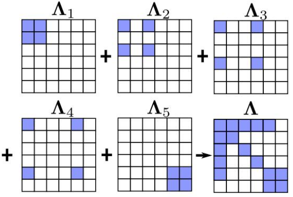
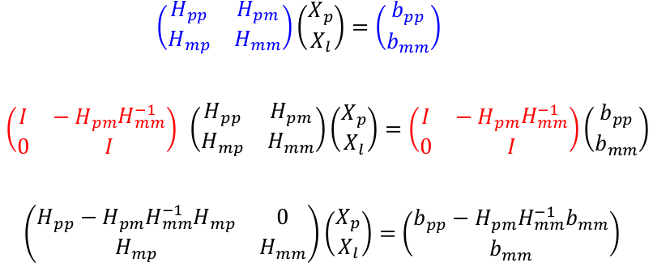
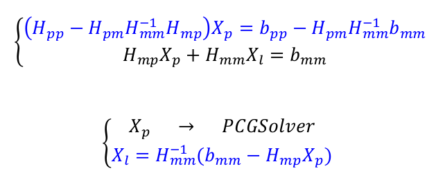

## 1.完成单目BA求解器problem.cc中的部分代码
*完成Problem::MakeHessian()中信息矩阵H的计算*

这里就是将计算出来的小hessian矩阵叠加起来即可，简单示例如图：

    // 所有的信息矩阵叠加起来
    // TODO:: home work. 完成 H index 的填写.
    H.block(index_i, index_j, dim_i, dim_j).noalias() += hessian;
    if (j != i)
    {
        // 对称的下三角
        // TODO:: home work. 完成 H index 的填写.
        H.block(index_j, index_i, dim_j, dim_i).noalias() += hessian.transpose();
    }

*完成Problem::SolveLinearSystem()中SLAM问题的求解*

在schur补的过程中，我们要边缘化的是特征点，reserve_size是位姿向量的长度，marg_size是特征点向量的长度，注意Eigen的下标是从0开始即可。

    // TODO:: home work. 完成矩阵块取值，Hmm，Hpm，Hmp，bpp，bmm
    MatXX Hmm = Hessian_.block(reserve_size, reserve_size, marg_size, marg_size);
    MatXX Hpm = Hessian_.block(0, reserve_size, reserve_size, marg_size);
    MatXX Hmp = Hessian_.block(reserve_size, 0, marg_size, reserve_size);
    VecX bpp = b_.segment(0, reserve_size);
    VecX bmm = b_.segment(reserve_size, marg_size);

回忆起Schur补的公式即可：

    // TODO:: home work. 完成舒尔补 Hpp, bpp 代码
    MatXX tempH = Hpm * Hmm_inv;
    H_pp_schur_ = Hessian_.block(0, 0, reserve_size, reserve_size) - tempH * Hmp;
    b_pp_schur_ = bpp - tempH * bmm;

    // TODO:: home work. step3: solve landmark
    VecX delta_x_ll(marg_size);
    delta_x_ll = Hmm_inv * (bmm - Hmp * delta_x_pp);
    delta_x_.tail(marg_size) = delta_x_ll;

分别注释和解注释TestMonoBA中的

    if (i < 2)
            vertexCam->SetFixed();

可以得到unfix和fix前两帧位姿的运行结果如下：

未fix前两帧位姿：

可以看到，在利用LM法优化后，第一帧相机的位置已经不再是原点(0, 0, 0)，这也印证了优化结果在零空间漂移的现象。

fix前两帧位姿：

解注释fix的代码，也就是将前两帧pose对应的jacobian设置为0，从而不去更新前两帧pose，将其固定在原点(0, 0, 0),可以看到结果符合预期。

## 2.完成滑动窗口算法测试函数
*完成Problem::TestMarginalize()中代码，并通过测试*

    // TODO:: home work. 将变量移动到右下角
    /// 准备工作： move the marg pose to the Hmm bottown right
    // 将 row i 移动矩阵最下面
    Eigen::MatrixXd temp_rows = H_marg.block(idx, 0, dim, reserve_size);
    Eigen::MatrixXd temp_botRows = H_marg.block(idx + dim, 0, reserve_size - idx - dim, reserve_size);
    H_marg.block(idx, 0, reserve_size - idx - dim, reserve_size) = temp_botRows;
    H_marg.block(reserve_size - dim, 0, dim, reserve_size) = temp_rows

    // TODO:: home work. 完成舒尔补操作
    Eigen::MatrixXd Arm = H_marg.block(0, n2, n2, m2);
    Eigen::MatrixXd Amr = H_marg.block(n2, 0, m2, n2);
    Eigen::MatrixXd Arr = H_marg.block(0, 0, n2, n2);

观察运行结果，可以得到以下几点结论：
* 变量2在信息矩阵中成功转移到了右下角
* 在marg之前，信息矩阵中的0表示变量1和3关于2条件独立，也就是1和3之间是没有边连接的，但是它们跟2都是相关联的，也就是与2之间有边连接
* 在marg掉2后，2留下的先验信息传递给了1和3，信息矩阵中相应位置不再是0，也即1与3之间产生了连接

## 3.总结论文：优化过程中处理H自由度的不同操作方式
论文中总结了三种处理H自由度的方式，分别为：
* free gauge approach（对应第1题中unfix的情况）: 允许参数在优化的时候自由变化，使用伪逆或者添加阻尼项的方式处理hessian矩阵，保证问题得到较好的参数更新
* gauge fixation approach（对应第1题中fix的情况）: 在优化的过程中将第一帧相机的位置和yaw角固定（VIO系统的4自由度不可观），等价于将相应参数对应的Jacobian块设置为0，因此残差也是0，从而不更新该优化变量
* gauge prior approach（对应提升题部分）: 为第1帧相机的状态添加先验约束（惩罚项）

## 4.在代码中为第一、二帧添加prior约束，并比较为prior设定不同权重时，BA求解收敛精度和速度

    // 添加先验约束，更改prior的权重Wp
    double Wp = 0;
    for (size_t k = 0; k < 2; ++k)
    {
        shared_ptr<EdgeSE3Prior> edge_prior(new EdgeSE3Prior(cameras[k].twc, cameras[k].qwc));
        std::vector<std::shared_ptr<Vertex>> edge_prior_vertex;
        edge_prior_vertex.push_back(vertexCams_vec[k]);
        edge_prior->SetVertex(edge_prior_vertex);
        edge_prior->SetInformation(edge_prior->Information() * Wp);
        problem.AddEdge(edge_prior);
    }

当Wp = 0时：

当Wp = 1e5时：

可以尝试从0开始以数量级形式递增Wp，会发现如下现象：
* 不同Wp的取值所估计的误差是非常接近的，也就是说Wp的取值对于精度的影响不大。且当Wp的增长至某个值以后，误差会稳定在某个值。
* 迭代次数和收敛时间同样会在Wp达到某个值以后稳定。但是Wp在从0增大的过程中，计算时间会出现一个峰值。

需要注意的是，当Wp=0是，基本等同于free gauge方法，当Wp=无穷时则等价于gauge fixation方法。