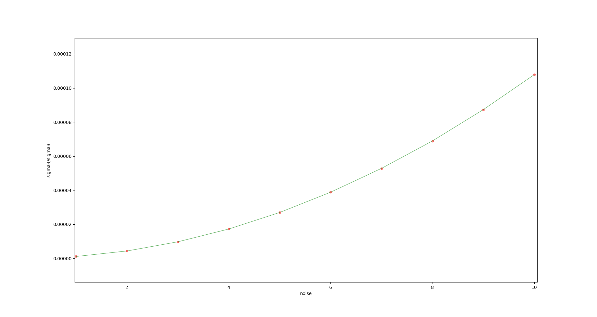

## 1.证明式(15)中，取$y = u_4$是该问题的最优解

## 2.完成特征点三角化代码，通过仿真测试

首先根据课件上的公式构建D矩阵，然后对D^TD矩阵进行SVD分解，即可求得对应的特征点坐标

    /* your code begin */
    Eigen::Matrix<double, Eigen::Dynamic, 4> D(2 * (poseNums - start_frame_id), 4);
    Eigen::RowVector4d P_1 = Eigen::RowVector4d::Zero(4);
    Eigen::RowVector4d P_2 = Eigen::RowVector4d::Zero(4);
    Eigen::RowVector4d P_3 = Eigen::RowVector4d::Zero(4);
    int k = 0;
    for (int i = start_frame_id; i < end_frame_id; ++i)
    {
        // Rcw、tcw为world系到camera系的转换
        Eigen::Matrix3d Rcw = camera_pose[i].Rwc.transpose();
        Eigen::Vector3d tcw = -Rcw * camera_pose[i].twc;
        P_1 << Rcw.block<1, 3>(0, 0), tcw.x();
        P_2 << Rcw.block<1, 3>(1, 0), tcw.y();
        P_3 << Rcw.block<1, 3>(2, 0), tcw.z();
        // 和slides公式相对应，构建D矩阵
        D.block<1, 4>(k, 0) = camera_pose[i].uv.x() * P_3 - P_1;
        D.block<1, 4>(k + 1, 0) = camera_pose[i].uv.y() * P_3 - P_2;
        k += 2;
    }
    Eigen::MatrixXd DTD = D.transpose() * D;
    Eigen::JacobiSVD<Eigen::MatrixXd> svd(DTD, Eigen::ComputeThinU | Eigen::ComputeThinV);
    // D = U*A*V^T，那么D^TD = V*A^T*U^T*U*A*V^T = V*A^T*A*V^T，
    // 由此可得D^T*D进行SVD分解和D进行SVD分解所得的U、A、V矩阵的关系
    // 这里的U也就是对D矩阵进行SVD分解得到的V矩阵，其最后一列也就是我们所求的y
    Eigen::MatrixXd U = svd.matrixU();
    P_est = U.block<3, 1>(0, 3) / U(3, 3); //取齐次坐标的前三维，并同时除以第四维坐标
    Eigen::Vector4d Singular_values = svd.singularValues();
    // 可以验证最小奇异值应该远小于其他奇异值
    std::cout << "Singular values:\n" << Singular_values << std::endl;
    std::cout << "sigma4/sigma3:\n" << Singular_values[3] / Singular_values[2] << std::endl;
    /* your code end */

仿真测试结果为：

可以看出，$\sigma_4/\sigma_3$(最小奇异值与第二小奇异值之比)小于1e-4，三角化有效。在不加任何噪声的情况下，所三角化出的坐标与真值完全相同。

## 3.对测量值增加不同噪声，观察最小奇异值和第二小奇异值之间的比例变化，并绘制比例值的变化曲线

    for (int i = start_frame_id; i < end_frame_id; ++i)
    {
        Eigen::Matrix3d Rcw = camera_pose[i].Rwc.transpose();
        // 将特征点在世界坐标系下的坐标转换到相机坐标系下
        Eigen::Vector3d Pc = Rcw * (Pw - camera_pose[i].twc);

        std::normal_distribution<double> noise_pdf(0, 1. / 2000.);

        double x = Pc.x();
        double y = Pc.y();
        double z = Pc.z();

        // 给归一化坐标加上测量噪声
        camera_pose[i].uv = Eigen::Vector2d(x / z + noise_pdf(generator), 
            y / z + noise_pdf(generator));
    }

修改代码中noise_pdf(0, * / 2000.)中的*数值，将其从1增加到10，可以看到$\sigma_4/\sigma_3$比例值变化曲线为：

## 4.固定噪声方差参数，将观测图像帧扩成多帧，观察最小奇异值和第二小奇异值之间的比例变化，并绘制比例值的变化曲线
噪声误差设定为5个像素误差(5./2000.)，start_frame_id从1取到10，取为10时比例值变为nan，9时比例值为0.885821，明显增大。
由此可见，当观测帧数量越小时，三角化的结果越不可靠。

## Appendix

*绘制第3题图像的Py代码*

    import matplotlib.pyplot as plt

    x_list = list(range(1, 11))
    lambda_list = [1.07474e-06, 4.3e-6, 9.68e-6, 1.72e-5, 2.69e-5, 
    3.88e-5, 5.28e-5, 6.89e-5, 8.73e-5, 0.000107808]

    plt.figure('lambda iteration')
    ax = plt.gca()

    ax.set_xlabel('noise')
    ax.set_ylabel('sigma4/sigma3')

    ax.scatter(x_list, lambda_list, c='r', s=20, alpha=0.5)
    ax.plot(x_list, lambda_list, c='g', linewidth=1, alpha=0.6)

    plt.show()

*绘制第4题图像的Py代码*

    import matplotlib.pyplot as plt

    x_list = list(range(1, 10))
    lambda_list = [1.33254e-05, 1.84001e-05, 2.69058e-05, 3.44701e-05, 
    3.28267e-05, 4.30012e-05, 4.82993e-05, 5.05506e-05, 0.885821]

    plt.figure('lambda iteration')
    ax = plt.gca()

    ax.set_xlabel('noise')
    ax.set_ylabel('sigma4/sigma3')

    ax.scatter(x_list, lambda_list, c='r', s=20, alpha=0.5)
    ax.plot(x_list, lambda_list, c='g', linewidth=1, alpha=0.6)

    plt.show()
