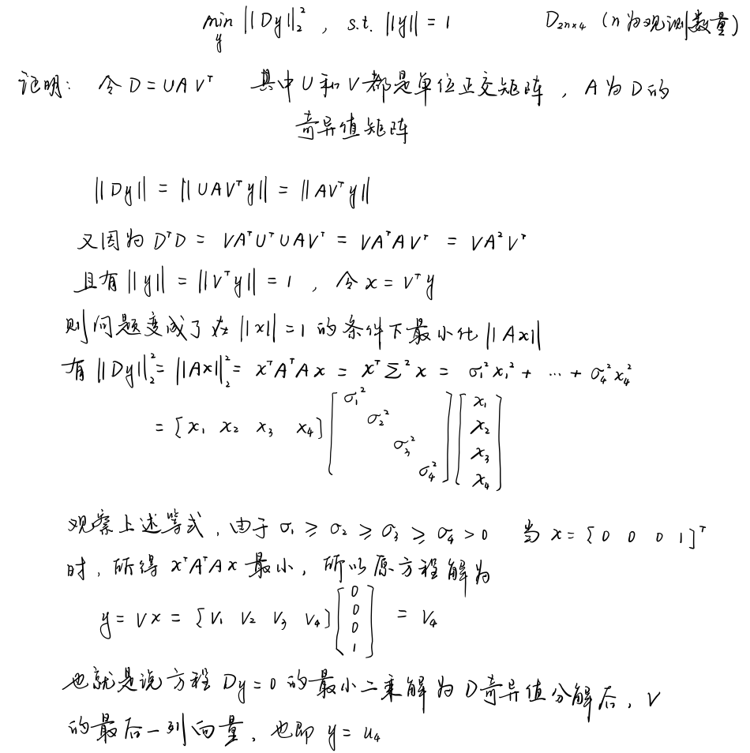

## 1.证明式(15)中，取$y = u_4$是该问题的最优解

## 2.完成特征点三角化代码，通过仿真测试

    /* your code begin */
    Eigen::Matrix<double, Eigen::Dynamic, 4> D(2 * (poseNums - start_frame_id), 4);
    Eigen::RowVector4d P_1 = Eigen::RowVector4d::Zero(4);
    Eigen::RowVector4d P_2 = Eigen::RowVector4d::Zero(4);
    Eigen::RowVector4d P_3 = Eigen::RowVector4d::Zero(4);
    int k = 0;
    for (int i = start_frame_id; i < end_frame_id; ++i)
    {
        Eigen::Matrix3d Rcw = camera_pose[i].Rwc.transpose();
        Eigen::Vector3d tcw = -Rcw * camera_pose[i].twc;
        P_1 << Rcw.block<1, 3>(0, 0), tcw.x();
        P_2 << Rcw.block<1, 3>(1, 0), tcw.y();
        P_3 << Rcw.block<1, 3>(2, 0), tcw.z();
        D.block<1, 4>(k, 0) = camera_pose[i].uv.x() * P_3 - P_1;
        D.block<1, 4>(k + 1, 0) = camera_pose[i].uv.y() * P_3 - P_2;
        k += 2;
    }
    Eigen::MatrixXd DTD = D.transpose() * D;
    Eigen::JacobiSVD<Eigen::MatrixXd> svd(DTD, Eigen::ComputeThinU | Eigen::ComputeThinV);
    Eigen::MatrixXd U = svd.matrixU();
    P_est = U.block<3, 1>(0, 3) / U(3, 3); //取齐次坐标的前三维，并同时除以第四维坐标
    Eigen::Vector4d Singular_values = svd.singularValues();
    std::cout << "Singular values:\n" << Singular_values << std::endl;
    std::cout << "sigma4/sigma3:\n" << Singular_values[3] / Singular_values[2] << std::endl;
    /* your code end */

仿真测试结果为：

## 3.对测量值增加不同噪声，观察最小奇异值和第二小奇异值之间的比例变化，并绘制比例值的变化曲线

    for (int i = start_frame_id; i < end_frame_id; ++i)
    {
        Eigen::Matrix3d Rcw = camera_pose[i].Rwc.transpose();
        Eigen::Vector3d Pc = Rcw * (Pw - camera_pose[i].twc);

        std::normal_distribution<double> noise_pdf(0, 1. / 2000.);

        double x = Pc.x();
        double y = Pc.y();
        double z = Pc.z();

        // 给归一化坐标加上测量噪声
        camera_pose[i].uv = Eigen::Vector2d(x / z + noise_pdf(generator), y / z + noise_pdf(generator));
    }

比例值变化曲线为：

## 4.固定噪声方差参数，将观测图像帧扩成多帧，观察最小奇异值和第二小奇异值之间的比例变化，并绘制比例值的变化曲线
噪声误差设定为5个像素误差(5./2000.)，start_frame_id设为1-10，取为10时比例值变为nan，9时比例值为0.885821，明显增大

