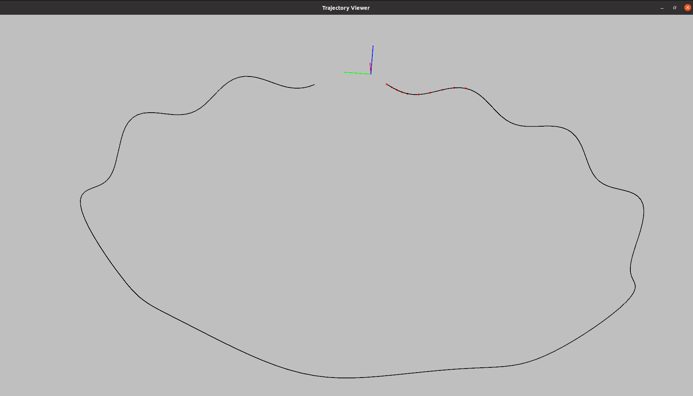
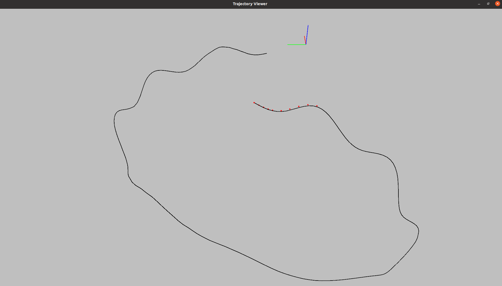
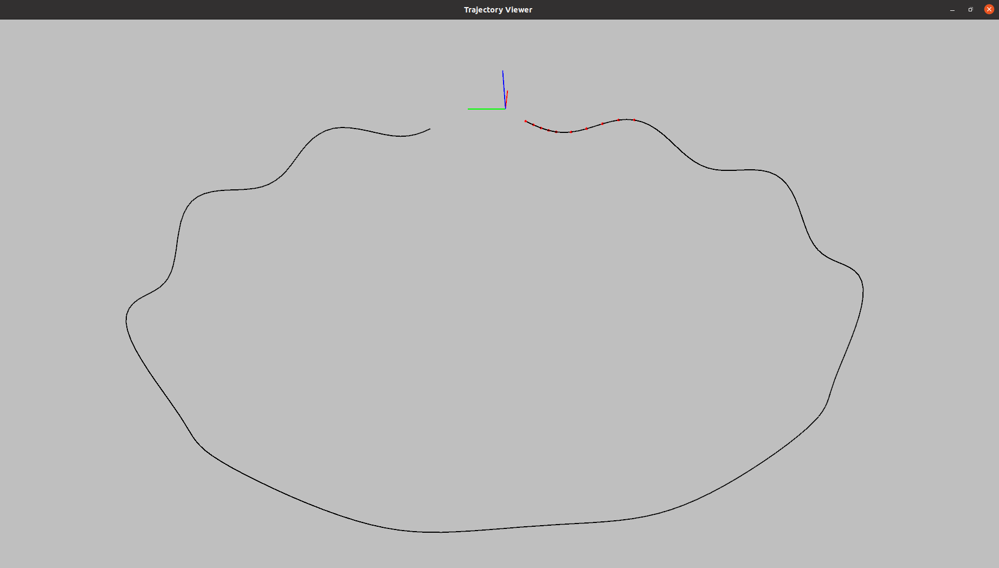
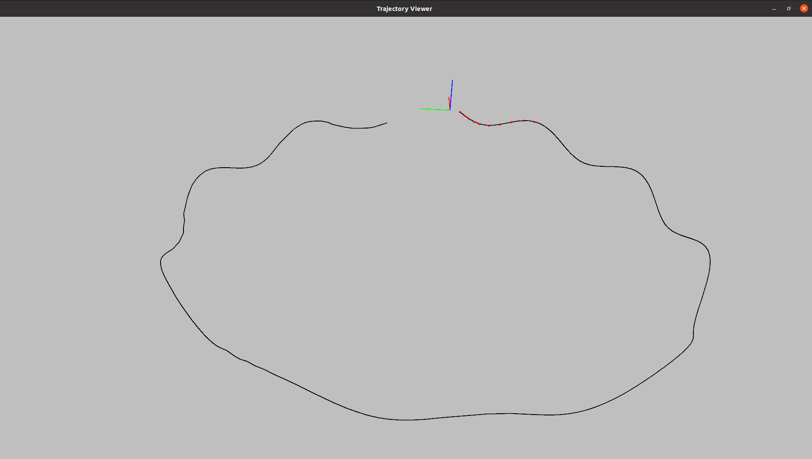

## 1.利用生成数据集运行VINS系统
* 代码增加文件run_sim.cpp和sim_config.yaml
* 重载函数System::PubImageData和FeatureTracker::readImage

* 运行代码：./run_sim ../data
*(1).无噪声*

*(2).acc_n: 0.019, gyr_n: 0.015, acc_w: 0.0019, gyr_w: 0.0015*

*(3).acc_n: 0.019, gyr_n: 0.0005, acc_w: 0.0001, gyr_w: 1.0e-6*

*(4).acc_n: 0.008, gyr_n: 0.007, acc_w: 0.002, gyr_w: 0.001*

通过对比可知，设置不同的IMU数据噪声，代码运行取得不同的效果。无噪声或小噪声时，估计轨迹与设置轨迹几乎一致；当噪声较大时，估计轨迹与设置轨迹产生较大偏移。