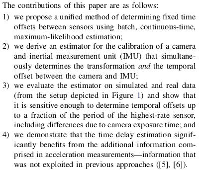

## 1.推导当VINS中对特征采用逆深度参数时，基于特征匀速模型的重投影误差计算形式

**不考虑时间戳延迟时**，在第$i$帧图片中第1次观测到的第$l$个特征点$p_l^{c_i}=[u_l^{c_i}, v_l^{c_i}]^T$，其在第$j$帧图片中的观测为$p_l^{c_j}=[u_l^{c_j}, v_l^{c_j}]^T$，通过$p_l^{c_j}$计算其在空间中的坐标：
$$\hat{p}_l^{c_j} = \pi_c^{-1}([u_l^{c_j}, v_l^{c_j}]^T)$$其中$\pi_c^{-1}(*)$为利用相机内参将像素坐标转化为归一化平面坐标的反投影函数。
通过相机位姿估计的$p_l^{c_j}$为：
$$p_l^{c_j} = (R_{cb}(R_{wb_j}^T(R_{wb_i}(R_{cb}^T([u_l^{c_i}, v_l^{c_i}]^T) - p_{cb})+p_{wb_i}) - p_{wb_j}^T)+p_{cb})$$所以基于逆深度的重投影误差为：
$$r_c = \hat{p}_l^{c_j} - p_l^{c_j}$$

**考虑时间戳延迟时**，需要对$p_l^{c_i}$和$p_l^{c_j}$都进行补偿：
$$p_l^{c_i}(t_d) = p_l^{c_i} + t_dV_l^i$$
$$p_l^{c_j}(t_d) = p_l^{c_j} + t_dV_l^j$$

## 2.总结基于B样条的时间戳估计算法流程，梳理论文公式

### A. Estimating Time Offsets using Basis Functions
考虑一个D维的状态向量$x(t)$ ，有：
$$\Phi(t) = [\Phi_1(t), ..., \Phi_B(t)], x(t) = \Phi(t)c$$
其中$\Phi_i(t)$为关于时间$t$的函数$(D*1)$，$\Phi(t)$为$D*B$的矩阵，使用$B*1$的系数矩阵$c$估计$x(t)$，当通过测量数据进行时间偏移的估计时，得到误差如下：
$$e_j = y_j - h(x(t_j+d))$$其中$y_j$是$t_j$时刻的测量值，$h(*)$为测量估计函数，$d$为未知的时间偏移，代入上式得到：
$$e_j = y_j - h(\Phi(t_j+d)c)$$对上式进行一阶泰勒展开，得到：
$$e_j = y_j - h(\Phi(t_j+d)c) + H\Phi'(t_j+d)c\Delta d$$其中
$$H = \frac{\partial h}{\partial x}|_{x\Phi(t_j+d)c}$$

### B. An Example: Camera/IMU Calibration
#### 1. Quantities Estimated
#### 2. Parameterization of Time-Varying States
时变状态由B样条函数表示，IMU的位姿使用$6*1$的样条参数化，其中3个自由度是姿态，另外3个是位置：
$$\boldsymbol{T}_{w,i}(t) = \begin{bmatrix} \boldsymbol{C}(\phi(t)) & \boldsymbol{t}(t) \\ \boldsymbol{0}^T & 1 \end{bmatrix}$$其中$\phi(t) = \Phi_{\phi}(t)c_{\phi}$编码姿态参数，函数$\boldsymbol{C}(*)$构建旋转矩阵：$\boldsymbol{t}(t) = \Phi_t(t)c_t$编码位置参数，对应的速度$v(t)$和加速度$a(t)$表示为：
$$v(t) = \boldsymbol{t}'(t) = \Phi'(t)c_t$$ $$a(t) = \boldsymbol{t}''(t) = \Phi''(t)c_t$$ 对于姿态参数，对应的角速度为：
$$\omega(t) = \boldsymbol{S}(\phi(t))\phi'(t) = \boldsymbol{S}(\Phi_{\phi}(t)c_{\phi})\Phi'_{\phi}(t)c_{\phi}$$ 其中$\boldsymbol{S}(*)$是与角速度参数相关的归一化矩阵
#### 3. Measurement and Process Models
IMU和相机的标准离散测量方程
#### 4. The Estimator
所构建的误差模型为：

