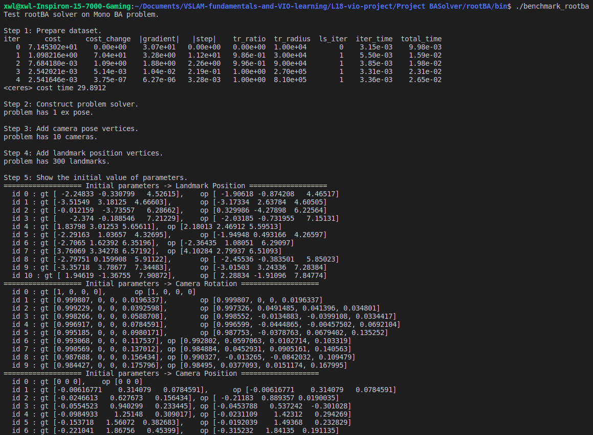
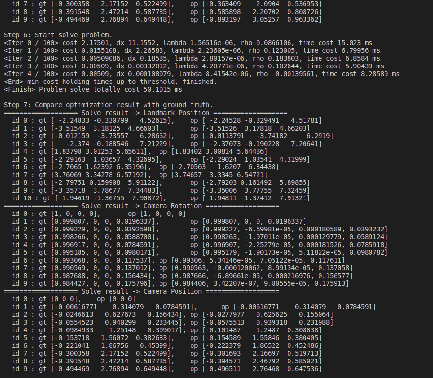
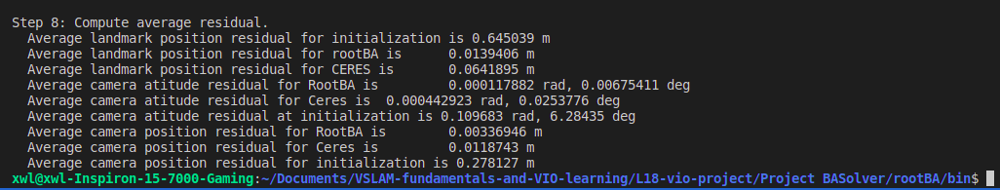

## RootBA论文复现

**1.计算Jacobian**

    //  TODO: task 1 calculate jacobian
    Eigen::Matrix<Scalar, 3, 6> tempJp = Eigen::Matrix<Scalar, 3, 6>::Zero();
    if (camera->IsFixed() == false)
    {
        tempJp.template block<3, 3>(0, 0) = -R_cb * R_bw;
        tempJp.template block<3, 3>(0, 3) = R_cb * SkewSymmetricMatrix(p_b);
    }

    // 计算雅可比矩阵 d(相机坐标位置误差) / d(特征点 3 自由度位置)
    Eigen::Matrix<Scalar, 3, 3> tempJl = Eigen::Matrix<Scalar, 3, 3>::Zero();
    if (this->landmark->IsFixed() == false)
    {
        tempJl = R_cb * R_bw;
    }

    // 计算雅可比矩阵 d(相机坐标位置误差) / d(相机外参 6 自由度位姿)
    // Hint: to calculate skew symmetric matrix, 
    // you could use function SkewSymmetricMatrix(*)
    Eigen::Matrix<Scalar, 3, 6> tempJex = Eigen::Matrix<Scalar, 3, 6>::Zero();
    if (this->exPose->IsFixed() == false)
    {
        tempJex.template block<3, 3>(0, 0) = -R_cb;
        tempJex.template block<3, 3>(0, 3) = SkewSymmetricMatrix(p_c);
    }
    // Fill in above this line

**2.执行QR分解，并更新storage矩阵**

    // TODO: task 2 执行QR分解，并更新sorage矩阵
    // 对 Jl 进行 QR 分解
    // HInt: Eigen::HouseholderQR could be used to perform QR decompose.
    Eigen::HouseholderQR<MatrixX<Scalar>> qr;
    qr.compute(Jl);
    MatrixX<Scalar> Q = qr.householderQ();

    // // 对 storage 矩阵左乘 Q.T
    this->storage.block(0, cols - 4, rows - 3, 3) = Q.transpose() * Jl;
    this->storage.block(0, 0, rows - 3, cols - 4) = Q.transpose() * Jp;
    this->storage.block(0, cols - 1, rows - 3, 1) = Q.transpose() * r;

    // Fill in above this line

**3.进行givens旋转，让storage矩阵指定位置数值为0，并存储中间结果**

    // TODO: task 3 进行givens旋转，让storage矩阵指定位置数值为0,并存储中间结果
    // Hint: makeGivens()函数可以进行givens旋转，
    // 其方法本质上就是传入 x1 和 x2，计算出旋转矩阵对应的 sin 和 cos
    gr.makeGivens(storage(i, n), storage(m, n));

    // 对 this->storage 矩阵进行初等变换，并将连乘结果记录下来
    this->storage.applyOnTheLeft(i, m, gr.adjoint());
    this->Q_lambda.applyOnTheLeft(i, m, gr.adjoint());

    // Fill in above this line

**4.对storage矩阵实现状态回退**

    //  TODO: task 3 对storage矩阵实现状态回退
    this->storage = this->Q_lambda.transpose() * this->storage;

    // Fill in above this line

**代码运行效果为：**

