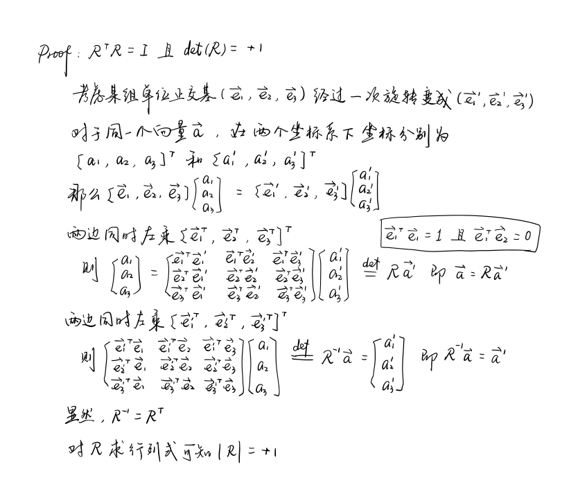
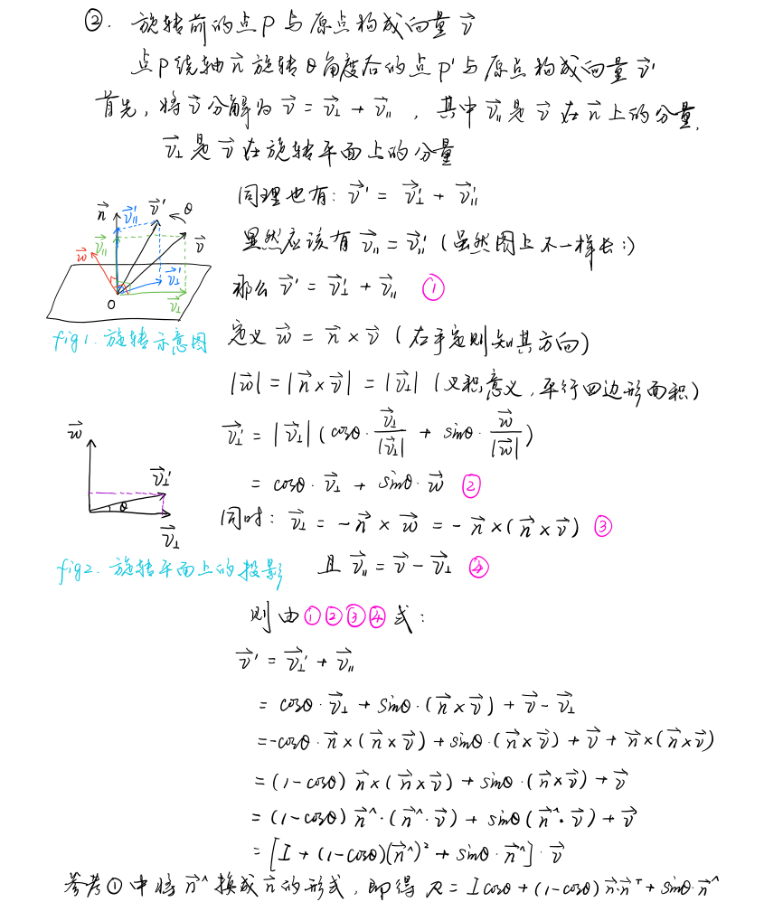

## 2.熟悉Eigen矩阵运算
给定$\boldsymbol{Ax = b}$，在$\boldsymbol{A}$为方阵的前提下，问：

*1.什么条件下，$\boldsymbol{x}$有解且唯一？*
在方程组增广矩阵$\boldsymbol{[A|b]}$和系数矩阵$\boldsymbol{A}$秩相等的前提下，如果系数矩阵的秩等于未知元的个数，那么方程组的解是唯一的；如果系数矩阵的秩小于未知元的个数，那么方程组的解是无穷多的。

*2.高斯消元法的原理是什么？*
高斯消元法是将方程组中的一方程的未知数用含有另一未知数的代数式表示，并将其代入到另一方程中，这就消去了一未知数，得到一解；或将方程组中的一方程倍乘某个常数加到另外一个方程中去，也可达到消去一未知数的目的。
核心是：（1）两方程互换，解不变；（2）一方程乘以非零常数k，解不变；（3）一方程乘以常数k再加上另一方程，解不变
-------------摘自百度百科

*3.$\boldsymbol{QR}$分解的原理是什么？*
$\boldsymbol{QR}$分解是将矩阵分解成一个正交矩阵与一个上三角矩阵的积，即$\boldsymbol{A = QR}$，这里的$\boldsymbol{Q}$是正交矩阵（意味着$\boldsymbol{Q^TQ = I}$），而$\boldsymbol{R}$是上三角矩阵，经常用其来求解线性最小二乘法问题。类似的，我们可以定义$\boldsymbol{A}$的$\boldsymbol{QL,RQ,LQ}$分解。

*4.cholesky分解的原理是什么？*
cholesky分解是把一个对称正定的矩阵表示成一个下三角矩阵$\boldsymbol{L}$和其转置$\boldsymbol{L^T}$的乘积的分解，即$\boldsymbol{A=LL^T}$。它要求矩阵的所有特征值必须大于0，故分解的下三角的对角元素也都是大于0的。cholesky分解法又称为平方根法，是当$\boldsymbol{A}$为实对称正定矩阵时，$\boldsymbol{LU}$三角分解法的变形。

5.Eigen解方程的结果

## 3.矩阵论基础
*1.什么是正定矩阵和半正定矩阵*
一个${n\times n}$的实对称矩阵$\boldsymbol{M}$是正定的，当且仅当对于所有的非零实系数向量$\boldsymbol{z}$，都有$\boldsymbol{z^TMz}$$>0$。其中$\boldsymbol{z^T}$表示$\boldsymbol{z}$的转置。对于复数的情况，定义则为：一个${n\times n}$的埃尔米特矩阵$\boldsymbol{M}$是正定的，当且仅当对于所有的非零复数向量$\boldsymbol{z}$，都有$\boldsymbol{z^TMz}$$>0$。其中$\boldsymbol{z^T}$表示$\boldsymbol{z}$的共轭转置。
对于半正定矩阵，和正定矩阵定义类似，但我们只需要$\boldsymbol{z^TMz}$$\geq0$即可。

*2.对于方阵$\boldsymbol{A}$，它的特征值是什么？特征向量是什么？特征值一定是实数吗？如何计算一个矩阵的特征值？*
对于一个给定的方阵$\boldsymbol{A}$，它的特征向量（eigenvector）$\boldsymbol{v}$经过这个线性变换之后，得到的新向量仍然与原来的$\boldsymbol{v}$保持在同一条直线上，但其长度或方向也许会改变，即$\boldsymbol{Av=\lambda x}$，$\boldsymbol{\lambda}$为标量，即特征向量的长度在该线性变换下缩放的比例，称$\boldsymbol{\lambda}$为其特征值（eigenvalue）。
实矩阵的特征值不一定都是实数，只有实对称矩阵的特征值才保证是实数。复矩阵的特征值也有可能是实数，例如$\boldsymbol{[1 \ i; -i \ 1]}$的特征值为0和2。
解方程$det$$\boldsymbol{(\lambda I - A = 0)}$即可求出$\boldsymbol{A}$矩阵的所有特征值。

*3.什么是矩阵的相似性？相似性反映了什么几何意义？*
相似矩阵是指存在相似关系的矩阵，相似关系是两个矩阵之间的一种等价关系。两个${n\times n}$矩阵$\boldsymbol{A}$与$\boldsymbol{B}$为相似矩阵当且仅当存在一个${n\times n}$的可逆矩阵$\boldsymbol{P}$，使得：$\boldsymbol{P^{-1}AP=B}$成立，$\boldsymbol{P}$被称为矩阵$\boldsymbol{A}$与$\boldsymbol{B}$之间的相似变换矩阵。
相似的矩阵是同一个线性变换在不同基/坐标系下的不同描述。

*4.矩阵一定能对角化吗？什么样的矩阵能保证对角化？不能对角化的矩阵能够形成什么样的形式（Jordan标准型）？*
不是所有的矩阵都能对角化，如果一个方阵$\boldsymbol{A}$相似于对角矩阵，也就是说，如果存在一个可逆矩阵$\boldsymbol{P}$使得$\boldsymbol{P^{-1}AP}$是对角矩阵，那它就被称为可对角化的。
不能对角化的矩阵一定具有多重特征值，对于不能对角化的矩阵也希望找到某种标准形式，使之尽量接近对角化的形式（Jordan标准型）,任何方阵$\boldsymbol{A}$均可通过某一相似变换化为如下Jordan标准形

其中称为Jordan块矩阵，$\boldsymbol{\lambda_1,\lambda_2,...,\lambda_i}$为$\boldsymbol{A}$的特征值，可以是多重的。

*5.奇异值分解（SVD）是什么意思？*
假设$\boldsymbol{M}$是一个${m\times n}$阶矩阵，其中的元素全部属于域$\boldsymbol{k}$，也就是实数域或者复数域，如此则存在一个分解使得$\boldsymbol{M=U\Sigma V^*}$，其中$\boldsymbol{U}$是一个${m\times m}$阶酉矩阵；$\boldsymbol{\Sigma}$是${m\times n}$阶非负实数对角矩阵；而$\boldsymbol{V^*}$即$\boldsymbol{V}$的共轭转置，是${n\times n}$阶酉矩阵。这样的分解称作$\boldsymbol{M}$的奇异值分解，$\boldsymbol{\Sigma}$对角线上的元素$\boldsymbol{\Sigma_{ij}}$即为$\boldsymbol{M}$的奇异值。常见的做法是将奇异值由大到小排列，这样$\boldsymbol{\Sigma}$可以唯一确定，虽然$\boldsymbol{U}$和$\boldsymbol{V}$仍然不能确定。

*6.矩阵的伪逆是什么意思（Pseudo inverse）?莫尔-彭罗斯逆是如何定义的？怎么计算一个矩阵的伪逆？*
矩阵的伪逆即矩阵的广义逆，具有部分逆矩阵的特性，但是不一定具有逆矩阵的所有特性。假设一矩阵$\boldsymbol{A\in R^{m\times n}}$以及另一矩阵$\boldsymbol{A^g\in R^{m\times n}}$，若$\boldsymbol{A^g}$满足$\boldsymbol{AA^gA=A}$，则$\boldsymbol{A^g}$即为$\boldsymbol{A}$的广义矩阵。
Moore-Penrose逆常被用来求解或简化一致线性方程组的最小范数最小二乘解。满足如下四个条件的广义逆矩阵可以称为Moore-Penrose逆：
（1）$\boldsymbol{AA^gA=A}$，$\boldsymbol{AA^g}$不一定是单位矩阵，但却不会改变$\boldsymbol{A}$的列向量
（2）$\boldsymbol{A^gAA^g=A^g}$，$\boldsymbol{A^g}$是乘法半群的弱逆
（3）$\boldsymbol{(AA^g)^H=AA^g}$，$\boldsymbol{AA^g}$是埃尔米特矩阵
（4）$\boldsymbol{(A^gA)^H=A^gA}$，$\boldsymbol{A^gA}$也是埃尔米特矩阵
可以通过SVD分解求矩阵的伪逆

*7.超定方程问题*
（a）在$\boldsymbol{b\neq 0}$时，$\boldsymbol{x}$的解是什么形式？对$\boldsymbol{A}$求奇异值和对$\boldsymbol{A^TA}$求特征值的关系是什么？
若$\boldsymbol{b\neq 0}$，则$\boldsymbol{x=(A^*A)^{-1}A^*b}$。$\boldsymbol{A=U\Sigma V^*}$中$\boldsymbol{\Sigma}$的非零对角元素（非零奇异值）是$\boldsymbol{A^TA}$非零特征值的平方根。

（b）$\boldsymbol{b=0}$时如何求$\boldsymbol{x}$的非零解？
对于超定方程$\boldsymbol{Ax=0}$的解就是$\boldsymbol{A^TA}$最小特征值对应的特征向量。具体推导参考了：https://blog.csdn.net/u011341856/article/details/107758182

（c）上述解法在几何上的理解？
从列向量的角度看待线性方程组。
最小二乘法的几何意义参考了教程：https://blog.csdn.net/Macer3/article/details/48394239

## 4.几何运算练习
*1.激光传感器下的点如何计算其世界坐标*
$\boldsymbol{p_w = q_{wr}*(q_{rb}*(q_{bl} * p_l + t_{bl})+t_{rb})+t_{wr}}$

*2.计算点在激光和世界系下的坐标*

## 5.旋转的表达
*1.证明旋转矩阵的性质*

*2.说明 $\varepsilon$和 $\eta$ 的维度*
$\varepsilon$虚部维度为3，$\eta$实部维度为1

*3.证明*

## 6.罗德里格斯公式的证明
*1.证明罗德里格斯公式*

*2.证明$\boldsymbol{R^{-1}=R^T}$*

## 7.四元数运算性质的验证

## *8.熟悉C++
*问：哪些地方用到了C++11标准的内容？*
1.对avec的初始化过程：Vector avec{a1, a2, a3}  是从C++11开始支持对vector的初始化列表
2.{return a1.index < a2.index;}是从C++11开始支持的lambda表达式
3.for(auto& a : avec)中包含了两个C++11新特性：auto自动类型推导和序列for循环（可以用于遍历数组、容器、string以及由begin和end函数定义的序列）