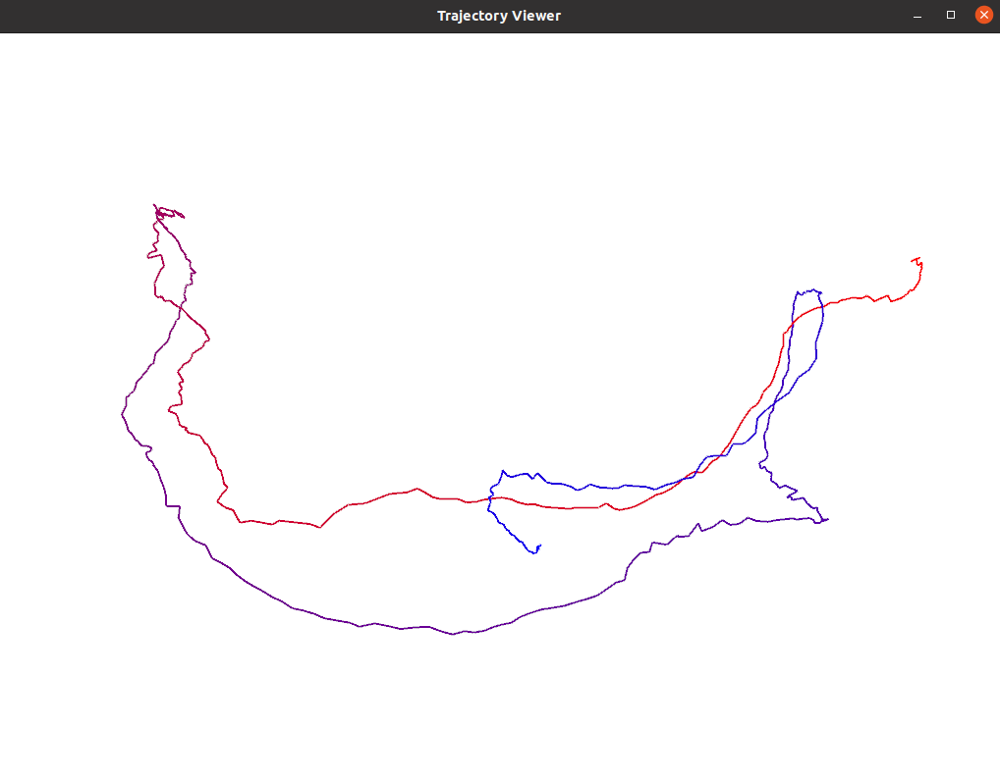
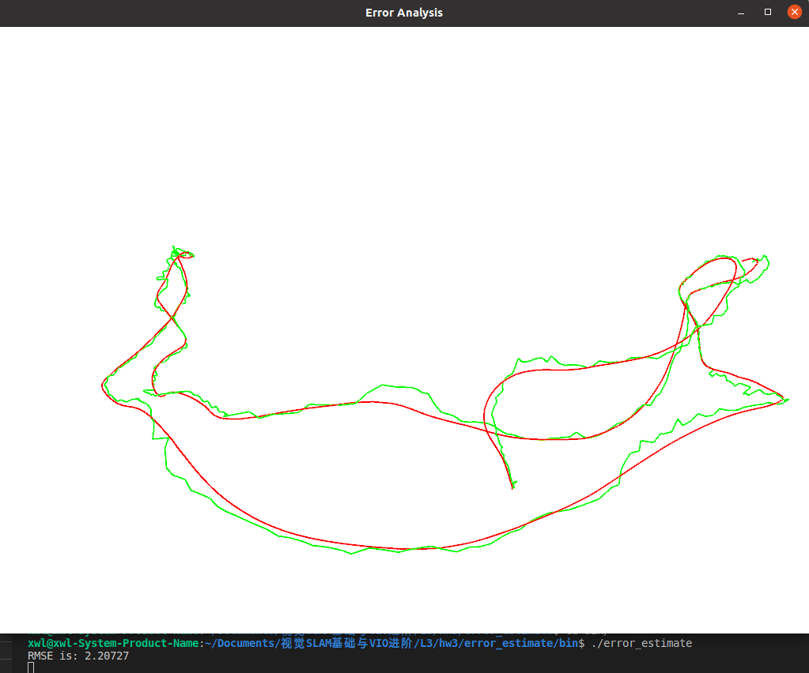

## 2.群的性质
*1.{$\mathbb{Z,+}$}是否为群？若是，验证其满足群定义；若不是，说明理由。*
* 封闭性：$ {\forall} a_1, a_2 \in \mathbb{Z}, a_1+a_2 \in \mathbb{Z} $
* 结合律：$ {\forall} a_1, a_2, a_3 \in \mathbb{Z},(a_1+a_2)+a_3 = a_1+(a_2+a_3) $
* 幺元：$ {\exists a_0=0 \in \mathbb{Z}}, s.t. \forall a \in \mathbb{Z}, 0+a = a+0 = a$
* 逆：$ \forall a \in \mathbb{Z}, \exists (-a) \in \mathbb{Z}, s.t. a+(-a) = 0 = a_0 $

显然，{$\mathbb{Z,+}$}成群

*2.{$\mathbb{N,+}$}是否为群？若是，验证其满足群定义；若不是，说明理由。*
* 封闭性：$ {\forall} a_1, a_2 \in \mathbb{N}, a_1+a_2 \in \mathbb{N} $
* 结合律：$ {\forall} a_1, a_2, a_3 \in \mathbb{N},(a_1+a_2)+a_3 = a_1+(a_2+a_3) $
* 幺元：$ {\exists a_0=0 \in \mathbb{N}}, s.t. \forall a \in \mathbb{N}, 0+a = a+0 = a$
* 逆：$ \exists 3 \in \mathbb{N}, \forall a \in \mathbb{N}, s.t. 3+a \neq 0 $

显然，{$\mathbb{N,+}$}不成群

*3.解释什么是阿贝尔群。并说明矩阵及乘法构成的群是否为阿贝尔群。*
阿贝尔群也成为交换群或可交换群，它是满足其元素的运算不依赖于它们的次序（交换律公理）的群。集合和二元运算$(A,*)$除了需要满足群公理以外，这个二元运算还需要满足交换律，即对于集合$A$中所有的$a,b$，都满足$a*b = b*a$。
矩阵乘法不满足交换律，故矩阵和乘法构成的群不是阿贝尔群。

其中$\mathbb{Z}$为整数集，$\mathbb{N}$为自然数集。

## 3.验证向量叉乘的李代数性质
见作业3（手写）.pdf

## 4.推导$SE(3)$的指数映射
见作业3（手写）.pdf

## 5.伴随
见作业3（手写）.pdf

## 6.常见函数的求导应用
见作业3（手写）.pdf

## 7.轨迹的描述
*1.$T_{wc}$的物理意义是什么？为何画出$T_{wc}$的平移部分就得到了机器人的轨迹？*
$T_{wc}$表示世界坐标系如何变换到机器人坐标系，也表示机器人坐标系下的坐标如何变换到世界坐标系下

*2.绘制轨迹*

## *8.轨迹的误差
