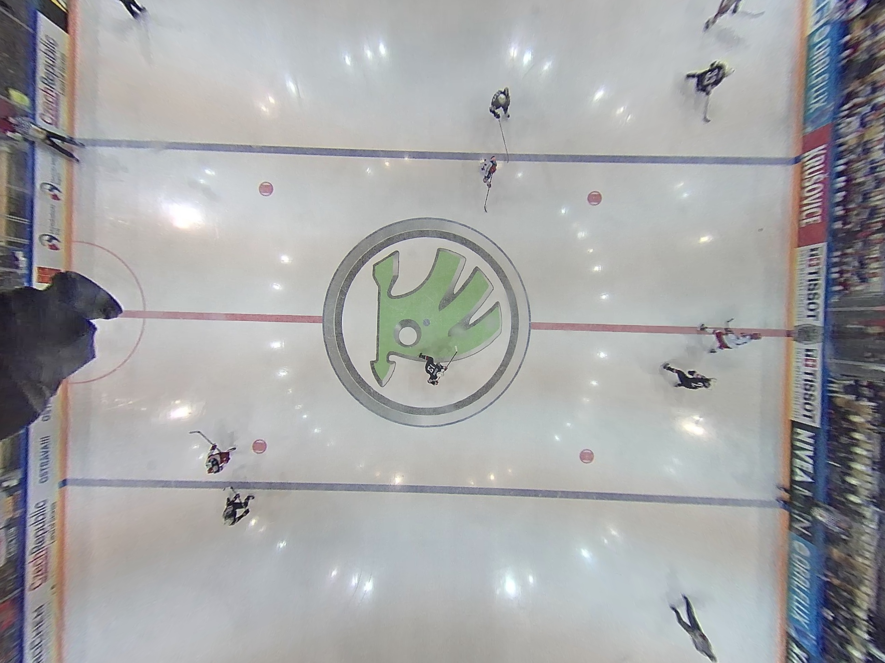
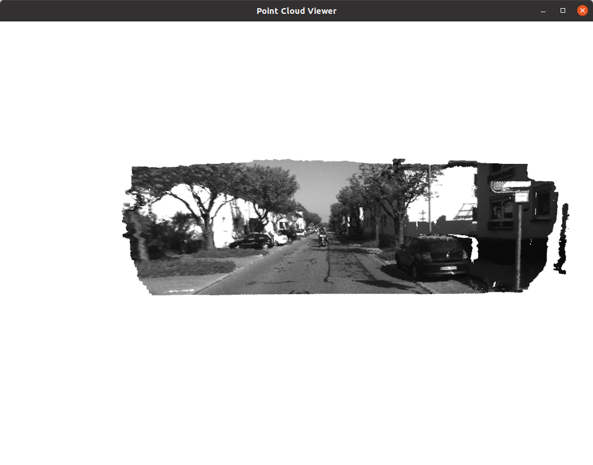
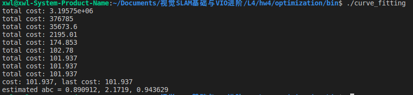

## 2.图像去畸变
代码见image_undistort文件夹，去畸变效果如下：

## 3.鱼眼相机与去畸变

*1.鱼眼相机相比于普通针孔相机在SLAM方面的优势*
鱼眼相机的FoV更大，相邻图像帧之间有更多的重叠区域，在相机剧烈运动的时候（比如有较快的旋转），相比于普通相机，视觉里程计更加不容易失效。

*2.整理并描述OpenCV中使用的鱼眼畸变模型（等距投影）是如何定义的，与上题中的畸变模型有何不同？*
**上题中的畸变模型**，在相机成像归一化平面上有
$x_{distorted} = x(1+k_1r^2+k_2r^4+k_3r^6)+2p_1xy+p_2(r^2+2x^2)$
$y_{distorted} = y(1+k_1r^2+k_2r^4+k_3r^6)+p_1(r^2+2y^2)+2p_2xy$
**OpenCV中鱼眼畸变模型**，在相机成像归一化平面上有
$\theta=atan(r)$
$\theta_d = \theta(1+k_1\theta^2+k_2\theta^4+k_3\theta^6+k_4\theta^8)$
$x_{distorted} = (\theta_d/r)x$
$y_{distorted} = (\theta_d/r)y$

其中均有$r^2 = x^2+y^2$

上一题的畸变模型包括了径向和切向两种畸变，本题中的鱼眼相机只给出了$\theta_d$一种畸变类型。

*3.完成畸变矫正*
代码见fisheye_undistort文件夹，去畸变效果如下：

*4.为什么$k_1,...,k_4=0$，依然可以达到去畸变的效果？*
实际的镜头因为制造工艺等各种原因并不会精确的符合投影模型，为了方便鱼眼相机的标定，一般取$r$关于$\theta$泰勒展开式的前5项来近似鱼眼相机的实际投影函数：$r_d = f\theta_d = k_0\theta+k_1\theta^3+k_2\theta^5+k_3\theta^7+k_4\theta^9$，因为$f=1$，且$\theta_d$的一次项系数$k_0$可以为1，最终得到OpenCV中使用的鱼眼相机模型：
$r_d = \theta_d = \theta+k_1\theta^3+k_2\theta^5+k_3\theta^7+k_4\theta^9$
$k_1,...,k_4$取0，相当于泰勒展开只近似了第一项，仍然可以达到一定的去畸变效果

*5.去畸变是否带来了图像内容的损失？如何避免这种图像内容上的损失？*
鱼眼图一般为圆形，边缘的信息被压缩的很密集，经过去畸变后原图中间的部分会被保留的很好，而边缘位置一般都会被拉伸的很严重、视觉效果差，所以通常会进行切除，因此肯定带来图像内容的损失。增大去畸变时图像的尺寸，或者使用单目相机和鱼眼相机图像进行融合，可以补全丢失的信息。

## 4.双目视差的使用
理论推导见作业4(手写).pdf
代码见stereo文件夹，深度恢复效果如下：

## 5.矩阵运算微分

见作业4(手写).pdf

## 6.高斯牛顿法的曲线拟合实验

代码见optimization文件夹
程序运行结果如下：

## *7.批量最大似然估计

见作业4(手写).pdf