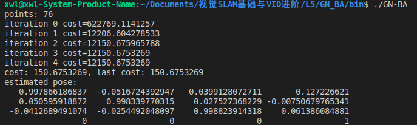
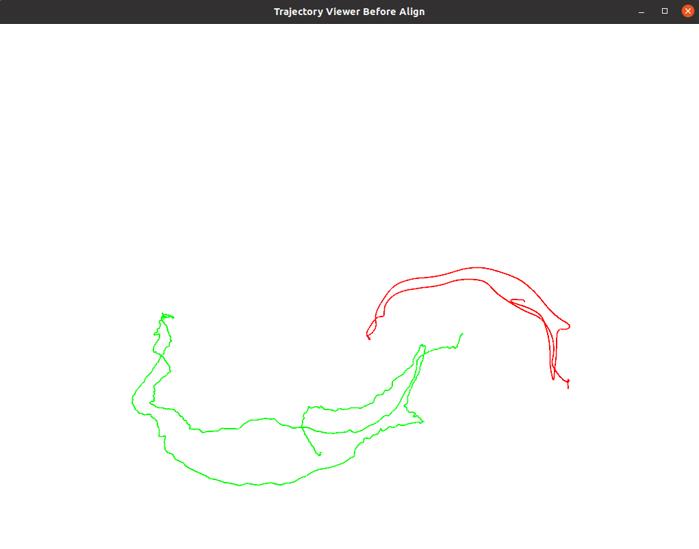

## 2.ORB特征点

ORB提取并计算角度如下：

暴力匹配结果如下：

*2.4 多线程ORB*
1.为什么说ORB是一种二进制特征？

因为ORB采用二进制的描述子来描述每个特征点的特征信息

2.为什么在匹配时使用50作为阈值，取更大或者更小值会怎么样？

50是一个经验值，如果取大了会带来更多的误匹配，取小了匹配的点数会比较少，需要折中取值

3.暴力匹配在你的机器上表现如何？是否有减少计算量的匹配方法？

在我的机器上需要100-130ms，可以采用快速最近邻(FLANN)的方法减少匹配时间

4.多线程版本相比单线程版本是否有提升？在你的机器上大约能提升多少性能？

计算特征点质心角度的函数我参考的ORB_SLAM3的写法，计算比较快，提速不明显，跑一次均在0.3+ms。计算描述子的函数耗时较多，多线程版本相比单线程版本快速很多，单线程大约3ms，多线程只需0.5ms

## 3.从E恢复R,t

程序运行结果为：

## 4.用G-N实现Bundle Adjustment中的位姿估计

1.如何定义重投影误差？

3D点投影到相机成像平面中的位置与观测位置作差
$\boldsymbol{e_i = u_i - \frac{1}{s_i} K}exp(\xi\hat)P_i$

2.该误差关于自变量的雅可比矩阵是什么？

$\boldsymbol{\frac{\partial e}{\partial\delta\xi} = -\begin{bmatrix}
    \frac{f_x}{Z'} & 0 & -\frac{f_xX'}{Z'^2} & -\frac{f_xX'Y'}{Z'^2} & f_x+\frac{f_xX^2}{Z'^2} & -\frac{f_xY'}{Z'} \\ 0 & \frac{f_y}{Z'} & -\frac{f_yY'}{Z'^2} & -f_y-\frac{f_yY^2}{Z'^2} & \frac{f_yX'Y'}{Z'^2} & \frac{f_yX'}{Z'}
\end{bmatrix}}$

3.解出更新量之后，如何更新至之前的估计上？

左乘或者右乘微小扰动$exp(dx)$均可

左乘结果：

右乘结果：

## 5.*用ICP实现轨迹对齐
轨迹对齐之前：

轨迹对齐之后：
