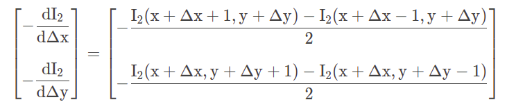
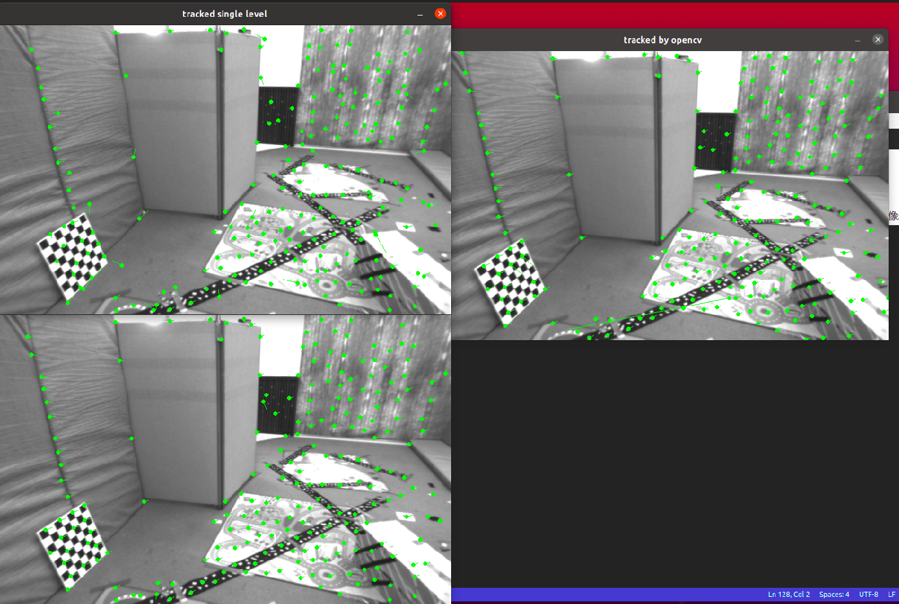
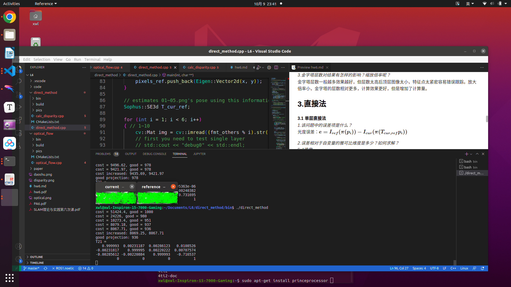
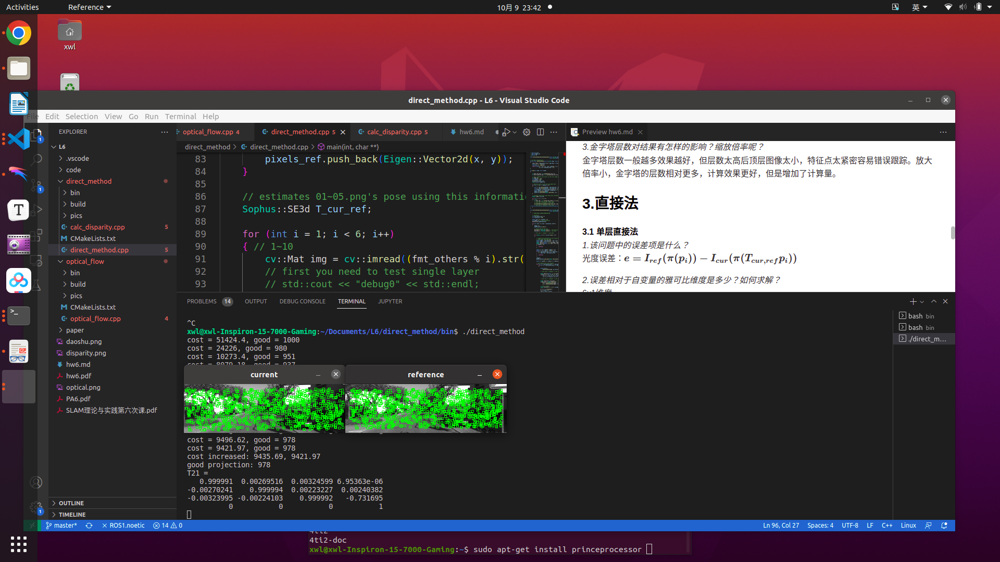
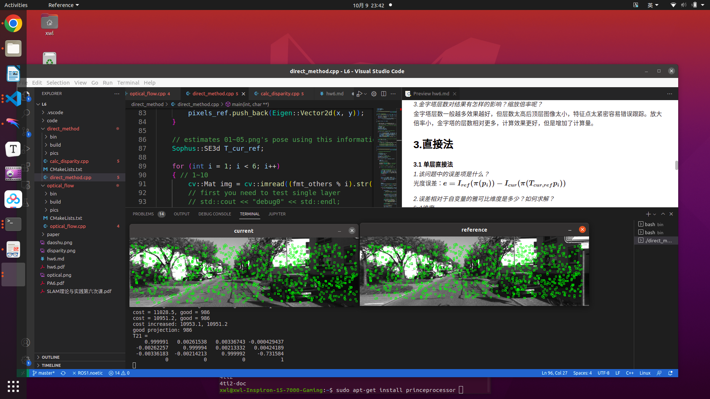
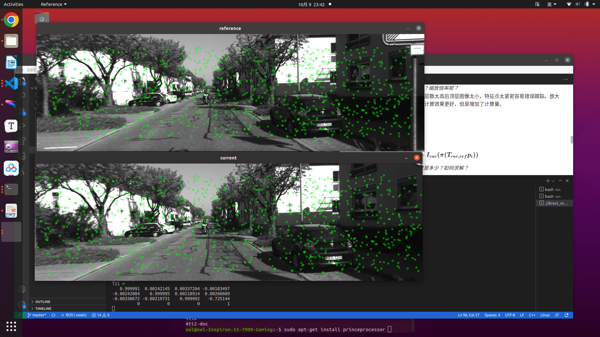
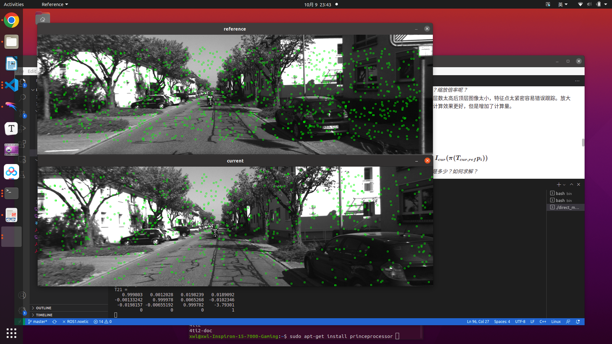
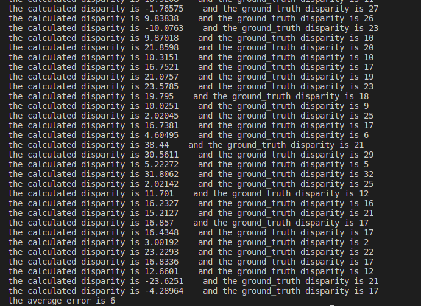

## 2.LK光流
**2.1 光流文献综述**
*1.光流可以分为哪几类？*

forward additive algorithm
forward compositional algorithm
inverse additive algorithm
inverse compositional algorithm

*2.在compositional中，为什么有时候需要做原始图像的wrap?该wrap有何物理意义？*

The incremental update to the wrap $W(x;\Delta p)$ must be composed with the current estimate fof the wrap $W(x;p)$ in the compositional algorithm.

*3.forward和inverse有何差别？*

As a number of authors have pointed out, there is a huge computational cost in re-evaluating the Hessian in every iteration of the LK algorithm. If the Hessian were constant it could be precomputed and then re-used.

**2.2 forward-addtive Gauss-Newton光流的实现**
*1.从最小二乘角度来看，每个像素的误差怎么定义？*
第一张图像在特征点$(x,y)$的像素值减去第二张图像在$(x+dx,y+dy)$处的像素值$\boldsymbol{I_1(x_i,y_i) - I_2(x_i+\Delta x_i,y_i+\Delta y_i)}$

*2.误差相对于自变量的导数如何定义？*
自变量为$[\Delta x, \Delta y]^T$，用中值差分表示图像梯度，导数则为：

**2.4 推广至金字塔**
*1.所谓coarse-to-fine是指怎样的过程？*
光流法中通过对图像缩放不同倍率，计算光流时先从最顶层图像开始计算，然后把上一层计算结果作为下一层计算的初始值，是一个由粗到精的过程。使用该方法后，图像实际运动太大时，图像缩小后运动的像素比较小，也能较好的追踪到。

*2.光流法中的金字塔用途和特征点法中的金字塔有何差别？*
特征点法金字塔用于在图像缩放不同尺度下对比特征点，保证特征点的尺度不变性，不论相机是向前运动还是向后运动，同一特征点都能在像素平面上匹配上。

**2.6 讨论**
*1.我们优化两个图像块的灰度之差真的合理吗？哪些时候不够合理？你有解决办法吗？*
LK光流有三个假设：亮度恒定，相邻帧运动幅度小，空间（局部）一致。在满足上述条件的情况下是合理的，但是当相邻图像整体灰度值变化较大，相机运动过快，特征点局部领域内灰度值不一致时不合理。
尽量保证相机曝光恒定（把曝光时间作为待估计变量），对图像块减去均值计算相对亮度信息，图像金字塔的方法可以改善上述情况。

*2.图像块大小是否有明显差异？取16x16和8x8的图像块会让结果发生变化吗？*
实际测试发现，图像块大效果更好，但窗口较大时，受野值影响小，结果更加鲁棒，但是窗口较小时，光流的计算更加精确。

*3.金字塔层数对结果有怎样的影响？缩放倍率呢？*
金字塔层数一般越多效果越好，但层数太高后顶层图像太小，特征点太紧密容易错误跟踪。放大倍率小，金字塔的层数相对更多，计算效果更好，但是增加了计算量。

## 3.直接法

**3.1 单层直接法**
*1.该问题中的误差项是什么？*
光度误差：$\boldsymbol{e = I_{ref}(\pi(p_i)) - I_{cur}(\pi(T_{cur,ref}p_i))}$

*2.误差相对于自变量的雅可比维度是多少？如何求解？*
6x1维度
$\boldsymbol{\frac{\partial \textbf(u)}{\partial\delta\xi} = \begin{bmatrix} \frac{f_x}{Z} & 0 & -\frac{f_xX}{Z^2} & -\frac{f_xXY}{Z^2} & f_x+\frac{f_xX^2}{Z^2} & -\frac{f_xY}{Z} \\ 0 & \frac{f_y}{Z} & -\frac{f_yY}{Z^2} & -f_y-\frac{f_yY^2}{Z^2} & \frac{f_yXY}{Z^2} & \frac{f_yX}{Z}\end{bmatrix}}$

$\boldsymbol{J^T = -\frac{\partial I_2}{\partial u}\frac{\partial u}{\partial\delta\xi}}$

*3.窗口可以取多大？是否可以取单个点？*
可以取4x4或者6x6等大小，如果取单个点会降低鲁棒性。

**3.4 延伸讨论**
*1.直接法是否可以类似光流，提出inverse,compositional的概念？它们有意义吗？*
可以。光流中优化的是$dx, dy$，inverse使用参考图片在$(x,y)$处的梯度可以减少计算量。

*2.请思考上面算法哪些地方可以缓存或者加速？*
可以减小图像块的大小，使用inverse的方法可以免去梯度重复计算。

*3.在上述过程中，我们实际假设了哪两个patch不变？*
对应点处patch灰度值、深度信息不变

*4.为什么可以随机取点？而不用取角点或者线上的点？那些不是角点的地方，投影算对了吗？*
直接法是通过最小化光度误差对位姿进行优化，不是角点也可以

*5.请总结直接法相对于特征点法的异同与优缺点*

## 4.*使用光流计算视差
