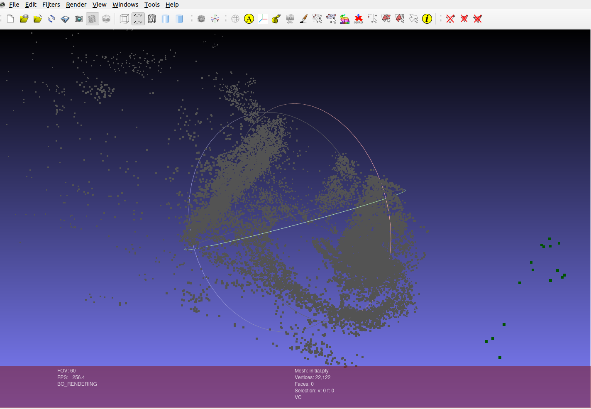
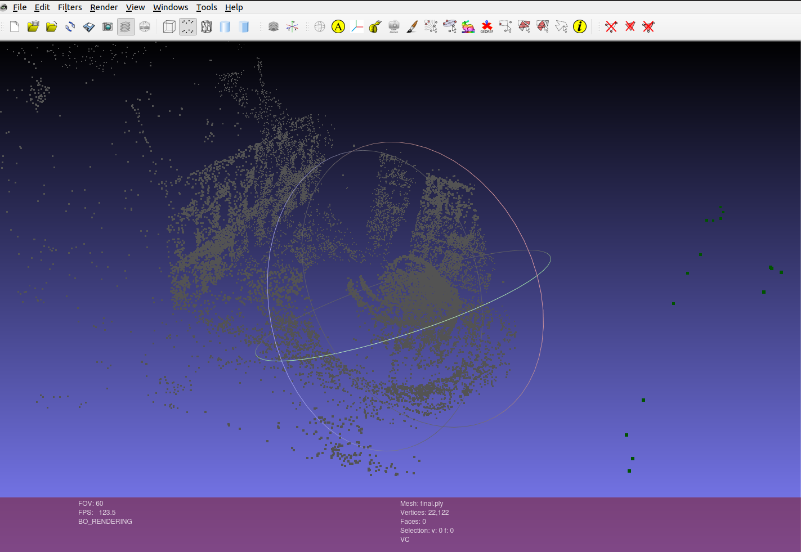
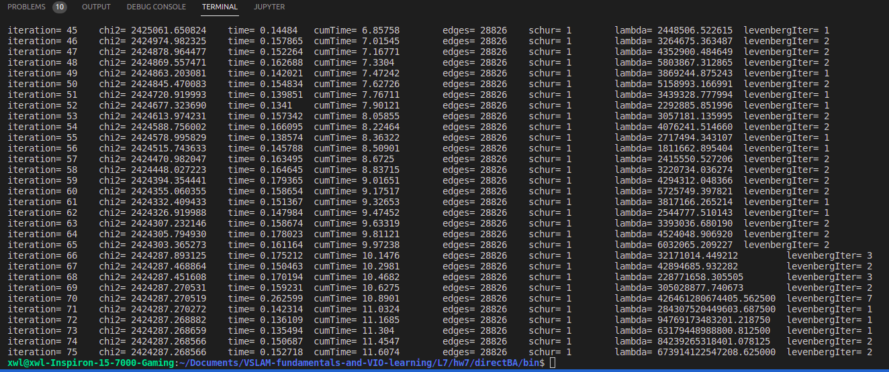
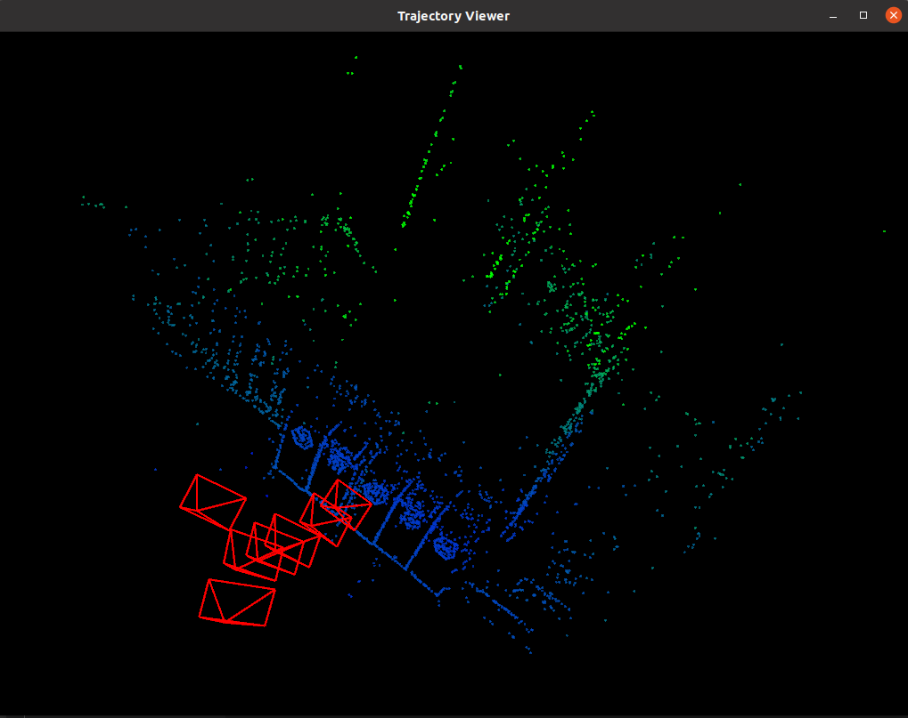

## 2.Bundle Adjustment
**2.1 文献阅读**

*1.为何说Bundle Adjustment is slow是不对的？*

Such statements often appear in papers introducing yet another heuristic Structure from Motion (SFM) iteration. The claimed slowness is almost always due to the unthinking use of a general-purpose optimization routine that completely ignores the problem structure and sparseness. Real bundle routines are much more efficient than this, and usually considerably more efficient and flexible than the newly suggested mothod. That is why bundle adjustment remains the dominant structure refinement technique for real applications, after 40 years of research.
总结：忽略了问题本身的结构与稀疏性就可能导致"Bundle Adjustment is slow"。直接对H矩阵求逆来计算增量方程，会消耗很多计算资源，实际上，由于H具有稀疏性，是可以利用加速技巧来进行求解的。

*2.BA中有哪些需要注意参数化的地方？Pose和Point各有哪些参数化方式？有何优缺点。*

The bundle adjustment parameter space is generally a high-dimensional nonlinear manifold, which is a large Cartesian product of projective 3D feature, 3D rotation, and camera calibration manifolds, perhaps with nonlinear constraints, etc.
**需要参数化的**有3D points(也就是路标点y)，3D Rotation(也就是相机位姿R,t)，相机校准(camera calibration,内参数)，投影后的像素坐标(u,v)等

The many variants on Euler angles for ratations, the singularity of affine point coordinates at infinity, quaternions with ||q||^2 = 1, homogeneous projective quantities have a scale factor freedom, etc.
**Pose**: 变换矩阵、欧拉角、四元数
欧拉角的优点在于非常直观，缺点是会产生万向锁问题；变换矩阵的优点是描述方便，缺点是产生参数过多，需要16个参数来描述变换过程；四元数的优点是计算方便，没有万向锁问题，缺点是理解困难、不直观。

**Point**: 三维坐标点(x,y,z)、逆深度
三维坐标点优点是比较简单直观，缺点是无法描述无限远的点；
逆深度优点在于能够建模无穷远点，在实际应用中，逆深度也有较好的数值稳定性。

*3.本文写于2000年，但是文中提到的很多内容在后面十几年的研究中得到了验证，你能看到哪些方向在后续工作中有所体现呢？请举例说明*

* Intensity-based方法就是直接法的Bundle Adjustment
* 文中提到的Network Structure对应现在应用比较广泛的图优化方法
* 利用H的稀疏性特性可以实现BA实时，在07年的PTAM上进行了实现

**2.2 BAL dataset**
选取的数据集为problem-16-22106
BA之前的点云图为

BA之后的点云图为

可以看出点云的结构特征有了非常明显的改善

## 3.直接法的Bundle Adjustment
**3.1 数学模型**

*1.如何描述任意一点投影在任一图像中形成的error?*
第i个特征点投影在第j个相机中，投影后点周围小块与原始的4x4小块之间灰度值的差异之和
$$\boldsymbol{e_{ij} = \sum_{W}||I(p_i) - I_j(\pi(KT_jp_i))||_2^2}$$

*2.每个error关联几个优化变量?*
第i个特征点投影在第j个相机中，关联第i个3D坐标点(3维)和第j个相机位姿(6维)这两个优化变量

*3.error关于各变量的雅可比是什么?*
$$\frac{\partial u}{\partial P}  = \begin{bmatrix} \frac{\partial u}{\partial X} & \frac{\partial u}{\partial Y} & \frac{\partial u}{\partial Z} \\ \frac{\partial v}{\partial X} & \frac{\partial v}{\partial Y} & \frac{\partial v}{\partial Z} \end{bmatrix} = \begin{bmatrix} \frac{f_x}{Z} & 0 & \frac{-f_xX}{Z^2} \\ 0 & \frac{f_y}{Z} & \frac{-f_yY}{Z^2} \end{bmatrix}$$

$$\frac{\partial P}{\partial \delta \xi} = \begin{bmatrix} I & -P\char`^ \end{bmatrix}$$

$$\frac{\partial u}{\partial\delta\xi} = \begin{bmatrix} \frac{f_x}{Z} & 0 & -\frac{f_xX}{Z^2} & -\frac{f_xXY}{Z^2} & f_x+\frac{f_xX^2}{Z^2} & -\frac{f_xY}{Z} \\ 0 & \frac{f_y}{Z} & -\frac{f_yY}{Z^2} & -f_y-\frac{f_yY^2}{Z^2} & \frac{f_yXY}{Z^2} & \frac{f_yX}{Z}\end{bmatrix}$$

对位姿$\xi_j$的Jacobian为：
$$J_{\xi_j} = -\frac{\partial I_j}{\partial u}\frac{\partial u}{\partial \delta \xi}$$

对三维点$P_i$的Jacobian为：
$$J_{P_i} = -\frac{\partial I_j}{\partial u}\frac{\partial u}{\partial P}$$

**3.2 实现**

*1.能否不要以$[x,y,z]^T$的形式参数化每个点?*
可以用逆深度的方式参数化

*2.取4x4的patch好吗?取更大的patch好还是取小一点的patch好?*
挺好的。
取更大的patch增加计算量；更小的patch鲁棒性变差

*3.从本题中，你看到直接法与特征点法在BA阶段有何不同?*
直接法计算光度误差，特征点法计算重投影误差，误差形式和雅可比形式不一样。

*4.由于图像的差异，你可能需要鲁棒核函数，例如Huber。此时Huber的阈值如何选取?*
可以先计算一步得到总误差除以点数获得一个平均误差，再根据该值设置Huber的阈值

程序运行结果为：

BA之后的效果如下：
