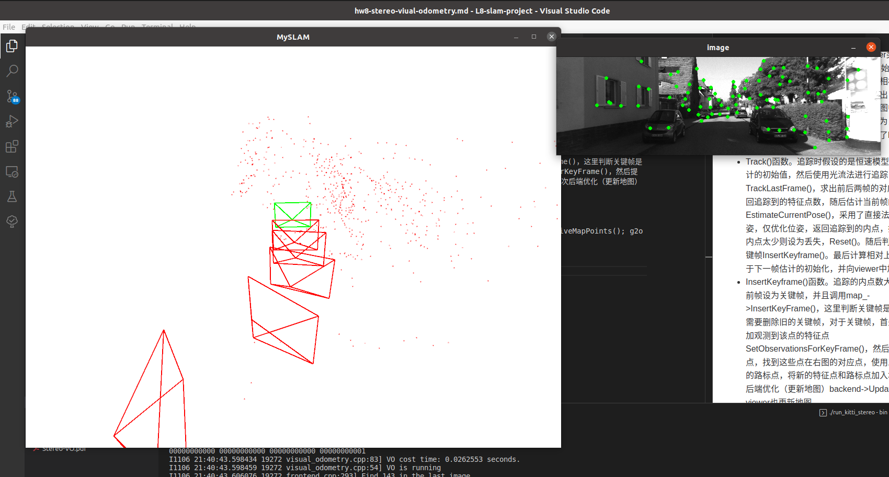

# <u>
Stereo Visual Odometry
</u>
 
Author: 夏威龙、石野
 

 我们组选题选的是双目视觉里程计的实现,主要参考高博SLAM十四讲的slambook的实现，涉及到的知识点有：CMake工程搭建、C++基础、三维旋转与坐标变换、特征点提取与光流跟踪、三角化、后端优化等等，算是把前面的章节都穿了一遍。夏威龙主要负责的是前端部分的维护，石野主要负责后端部分的维护，下面是对该工程的介绍。

 该工程主要分为三个线程：前端frontend、后端backend与可视化viewer。双目算法的流程比较简单，只追踪左目图像的位姿。初始化时，检测左目图像的特征，在右目图像中找到与左目图像对应的特征，如果找到的点太少，则下一帧继续进行初始化。由于左目图像初始位姿为原点，那么右目图像可以通过标定外参得到其位姿，接下来就可以进行特征点的三角化，建立初始地图，第一帧作为关键帧（每次更新关键帧时后端都进行一次优化）。假设相机运动为恒速模型，以此为下一帧提供位姿估计初始值，用于光流法跟踪特征点，得到前后两个左目图像帧匹配的特征点。随后用直接法解算较为精确的位姿，如果追踪的点太少就reset。随后判断是否加入关键帧，当追踪的内点(inlier)太少，则当前帧设置为关键帧。使用滑动窗口(sliding windows)的方式管理关键帧和地图点，如果关键帧太多(>7)需要进行剔除，这里直接去掉旧的关键帧和地图点，使关键帧和地图点维持在一定的数量。添加关键帧后继续提取新的特征点，并找到右目的匹配点，三角化新的地图点，并更新地图，触发后端优化线程工作。

 初始化部分：run_kitti_stereo.cpp文件初始化一个VisualOdometry类(实例化为vo)，传入参数文件，并调用vo中的初始化函数Init()，vo->Init()函数实例化一个Dataset类的对象dataset_，并调用dataset_中的初始化函数Init()，dataset_->Init()读取图片文件地址和相机内参等。随后vo->Init()创建前端、后端、map和viewer类（生成相应的智能指针，调用一些set()函数）。初始化完成后，run_kitti_stereo.cpp调用vo->run()函数，该函数循环调用vo中的step()函数，vo->step()通过dataset_中的NextFrame()函数，连续读取下一帧图像，并调用frontend中的AddFrame()函数添加该帧。

前端：
* Frontend()函数初始化设定特征点个数等参数
* AddFrame()函数中根据当前状态status_分为初始化Stereo()、好的追踪（当前帧设置为下一帧，return继续追踪）、坏的追踪都进行Track()，丢失则进行Reset()。最终将当前帧设置为上一帧。
* StereoInit()函数。检测左目图像特征DetectFeatures()，在右目图像找到左目图像对应的特征FindFeaturesInRight()，如果对应的特征点太少则返回false，这会使状态重新进行初始化，下一帧依然进行初始化过程。特征点足够则建立初始地图，BuildInitMap()，并将状态改为好的追踪。同时向viewer类中增减当前帧，且更新viewer类中的地图。BuildInitMap()函数中进行三角化，初始化地图点：左右对应的特征点已知，而初始化的左相机位置为原点，且右相机可以通过标定的参数求出，因此能进行三角化。初始化地图点后，则插入地图中map->InsertMapPoint()，并且将第一帧作为关键帧，由于更新了关键帧，后端则需要更新地图了backend_->UpdateMap()。
* Track()函数。追踪时假设的是恒速模型，作为位姿估计的初始值，然后使用光流法进行追踪TrackLastFrame()，求出前后两帧的对应特征点并返回追踪到的特征点数，随后估计当前帧的位姿EstimateCurrentPose()，采用了直接法求解当前位姿，仅优化位姿，返回追踪到的内点，如果追踪到的内点太少则设为丢失，Reset()。随后判断是否插入关键帧InsertKeyframe()。最后计算相对上一帧的位姿用于下一帧估计的初始化，并向viewer中加入当前帧。
* InsertKeyframe()函数。追踪的内点数大于阈值时将当前帧设为关键帧，并且调用map_->InsertKeyFrame()，这里判断关键帧是不是太多,太多需要删除旧的关键帧，对于关键帧，首先为地图点增加观测到该点的特征点SetObservationsForKeyFrame()，然后提取新的特征点，找到这些点在右图的对应点，使用三角化建立新的路标点，将新的特征点和路标点加入地图触发一次后端优化（更新地图）backend->UpdateMap()，viewer也更新地图。

后端：
* 构造函数初始化一个线程，回调函数BackendLoop()
* BackendLoop： 仅优化激活的Frames和Landmarks：map->GetActiveKeyFrames()，map_->GetActiveMapPoints(); g2o优化Optimize()。

最终运行效果如下：（Kitti sequence00 dataset）

代码运行步骤：
cd stereo-odometry && mkdir build && cd build 
cmake .. && make -j8
cd ../bin && ./run_kitti_stereo
注意config中配置文件的dataset_dir设置为自己的数据集地址
